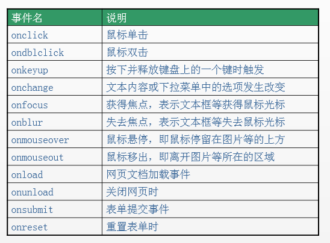
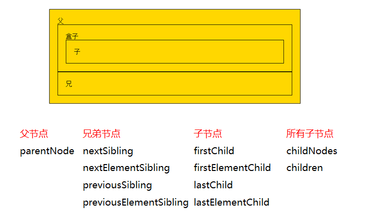

# js笔记

学习内容：

对象

数组--特殊对象

函数--特殊对象

类

数组类

函数类

日期类

正则类

错误类

垃圾回收机制：

当不在有任何引用指向一个对象时，就可以删除了


## 内置对象

### Array

#### 遍历迭代

##### forEach(callback)

遍历

##### map(callback)

创建一个新数组，其结果是该数组中每个元素都调用一个提供的函数后返回的结果。
即map()方法调用后返回一个新数组，新数组中的元素是callback函数的返回值。

##### some(callback)

满足条件，退出

测试数组中的某些元素是否通过由提供的函数实现的测试。
测试，返回boolean值，每个元素都会调用执行callback函数，当callback函数返回为false时，继续遍历下一个元素，直到遍历结束，最终返回false。如果在遍历到某个元素时，callback返回true则结束遍历，some()返回true的结果。

##### every(callback)

不满足条件，退出

测试数组中的每一个元素是否通过由提供的函数实现的测试必须全部符合条件才会返回true，否则返回false。

##### filter(callback)

过滤，筛选出callback函数返回值为true的对应元素，放到新的数组中。

#### 常用API 

#### 向数组添加元素的方法：

##### Array.push(value1,value2,…）

- 向数组的末尾追加
- 返回值是添加数据后数组的新长度。
- 会改变原有数组

**Array.unshift(value1,value2,…)**

- 向数组的开头添加
- 返回值是添加数据后数组的新长度。
- 会改变原有数组

##### splice(index,0,value1,value2,…)

- 在index位置，删除一定个数的元素，并插入新元素
- 向数组的指定index处插入
- 返回的是被删除的元素，返回的是一个数组,0指的是删除0个元素
- 会改变原有数组
- value可以不写，那就是单纯的删除元素了

#### 向数组删除元素的方法：

**pop()**

- 从尾部删除一个元素
- 返回被删除掉的元素。
- 会改变原有数组

**shift()**

- 从头部删除一个元素
- 返回被删除掉的元素。
- 会改变原有数组

##### splice(index,howmany)

#### 数组排序的方法：

**reverse()**

- 反转，倒置
- 该方法会改变原有数组。

**sort()**

- 按指定规则排序
- 改变原有数组。

arr1.sort((a,b)=>a-b)

 真正的排序；a-b是升序；b-a是降序

#### 数组连接的方法：

**concat()**

- 数组连接
- 返回连接后的新数组

**join()**

- 将数组的每个元素以指定分隔符(默认为“,”)连接成字符
- 返回该连接完成后的字符串

#### 数组截取的方法：

**slice(start,end)**

- 从start起始索引处，截取到end结束索引处

- 返回截取到的元素集合。
  **注意：**

  **end位置的值不会截取**

  **从前往后,数字代表位置**

  如果不传值那么就是直接拷贝了一份数组的值。
  end可以不传值，表示截取到数组的末尾。start与end也可以取负值，取负值表示从后向前计数。

#### 数组转换的方法：

##### toString()

- 转换为字符串，和不传参数的join()一致，还可以使用2，8，16进制转变为不同结果。

##### flat()

**提取数组指定深度的方法**

- 按照指定的深度递归遍历数组
- 返回值是遍历到的所有元素集合。

```javascript
let arr = [1,2,[3,4,[5,6]]],
res = arr.flat(Infinity),  //无限递归，直到最后
res2 = arr.flat();		//如果不传参数那么只递归一次
console.log(arr)   //[1,2,[3,4,[5,6]]]
console.log(res)   //[1, 2, 3, 4, 5, 6]
console.log(res2)	//[1,2,3,4,[5,6]]
```

#### 数组查找的方法

##### indexOf(val[, fromIndex = 0])

数组的indexOf方法用来查找数组中某个val值第一次出现的索引，找不到返回 -1
val表示待查找的值
fromIndex可选参数，表示起始查找位置，默认值是0

##### lastIndexOf(val[, fromIndex = arr.length - 1])

数组的lastIndexOf()方法用来查找数组中的某个val值第一次出现的索引，找不到返回 -1，lastIndexOf是从数组的最后往前找。
val表示待查找的值
fromIndex可选参数，表示起始查找位置,默认值是数组的长度-1

#### 遍历数组计算总和

**array.reduce((reslute, currentValue, index, array) => {}, initialValue)**
数组的reduce方法适合用来计算数组某一指定内容的累加或者其他运算结果的总结果。

**array.reduceRight((reslute, currentValue, index, array) => {}, initialValue)**
用法与array的reduce方法一致，只是reduceRight的计算过程是从后往前，而reduce是从前往后。

**Array.isArray(param)**
判断参数param是否是Array
是数组返回true
不是数组返回false

### String

#### 查找字符串

indexOf()/lastIndexOf()：获取字符串中指定内容的索引

search()：获取字符串中指定内容的索引（参数里一般是正则）

includes()：字符串中是否包含指定的内容

startsWith()：字符串是否以指定的内容开头

endsWith()：字符串是否以指定的内容结尾

#### 获取指定位置的字符

charAt(index)

str[index]

charCodeAt(index)

#### 字符串截取

slice()

substring()

substr()

#### 连接字符串

concat()   		//拼接字符串，等效于+，+更常用

#### 字符串转为数组

split()

新的数组 = str.split(分隔符);

#### `String.fromCharCode()`：根据字符的 Unicode 编码获取字符。

#### 替换字符串

replace

新的字符串 = str.replace(被替换的字符，新的字符);

**注：**如需全局替换，需要使用正则：     /被替换字符/gi

#### repeat()：重复字符串

newStr = str.repeat(重复的次数);

#### `trim()`：去除字符串前后的空白

#### 大小写转换

to(Locale)UpperCase() 	//转换大写
to(Locale)LowerCase() 	//转换小写

#### html 方法

var str = '你好';

console.log(str.anchor());
console.log(str.big());
console.log(str.sub());
console.log(str.sup());
console.log(str.link('http://www.baidu.com'));
console.log(str.bold());

### Number

#### Number.isInteger() 判断是否为整数

布尔值 = Number.isInteger(数字);

#### toFixed() 小数点后面保留多少位

字符串 = myNum.toFixed(num);

### Math

与众不同，他不是一个构造函数，不需要创建对象，直接使用里面的属性和方法即可

#### Math.PI

| 方法              | 描述                                       | 备注              |
| :---------------- | :----------------------------------------- | :---------------- |
| Math.PI           | 圆周率                                     | Math对象的属性    |
| Math.abs()        | **返回绝对值**                             |                   |
| Math.random()     | 生成0-1之间的**随机浮点数**                | 取值范围是 [0，1) |
| Math.floor()      | **向下取整**（往小取值）                   |                   |
| Math.ceil()       | **向上取整**（往大取值）                   |                   |
| Math.round()      | 四舍五入取整（正数四舍五入，负数五舍六入） |                   |
| Math.max(x, y, z) | 返回多个数中的最大值                       |                   |
| Math.min(x, y, z) | 返回多个数中的最小值                       |                   |
| Math.pow(x,y)     | 乘方：返回 x 的 y 次幂                     |                   |
| Math.sqrt()       | 开方：对一个数进行开方运算                 |                   |

#### 生成 [x, y) 之间的随机数

```javascript
    Math.round(Math.random()*(y-x)+x)
```

#### 【重要】生成 [x, y]之间的随机整数

也就是说：生成两个整数之间的随机整数，**并且要包含这两个整数**。

这个功能很常用，我们可以将其封装成一个方法，代码实现如下：

    /*
    * 生成两个整数之间的随机整数，并且要包含这两个整数
    */
    function getRandom(min, max) {
        return Math.floor(Math.random() * (max - min + 1)) + min;
    }
    
    console.log(getRandom(1, 10));

### Date

#### 创建对象

##### 写法一：不传递参数时，则获取系统的当前时间对象

var date1 = new Date();
console.log(date1);
console.log(typeof date1);

##### 写法二：传递参数

传递字符串

```javascript
const date11 = new Date('2020/02/17 21:00:00');
console.log(date11); // Mon Feb 17 2020 21:00:00 GMT+0800 (中国标准时间)

const date12 = new Date('2020/04/19'); // 返回的就是四月
console.log(date12); // Sun Apr 19 2020 00:00:00 GMT+0800 (中国标准时间)

const date13 = new Date('2020-05-20');
console.log(date13); // Wed May 20 2020 08:00:00 GMT+0800 (中国标准时间)

const date14 = new Date('Wed Jan 27 2017 12:00:00 GMT+0800 (中国标准时间)');
console.log(date14); // Fri Jan 27 2017 12:00:00 GMT+0800 (中国标准时间)
```

传递多个数字

```javascript
const date21 = new Date(2020, 2, 18); // 注意，第二个参数返回的是三月，不是二月
console.log(date21); // Wed Mar 18 2020 00:00:00 GMT+0800 (中国标准时间)

const date22 = new Date(2020, 3, 18, 22, 59, 58);
console.log(date22); // Sat Apr 18 2020 22:59:58 GMT+0800 (中国标准时间)

const params = [2020, 06, 12, 16, 20, 59];
const date23 = new Date(...params);
console.log(date23); // Sun Jul 12 2020 16:20:59 GMT+0800 (中国标准时间)
```

传递时间戳

```javascript
const date31 = new Date(1591950413388);
console.log(date31); // Fri Jun 12 2020 16:26:53 GMT+0800 (中国标准时间)

// 先把时间对象转换成时间戳，然后把时间戳转换成时间对象
const timestamp = new Date().getTime();
const date32 = new Date(timestamp);
console.log(date32); // Fri Jun 12 2020 16:28:21 GMT+0800 (中国标准时间)
```


#### 对象方法

Date对象 有如下方法，可以获取日期和时间的**指定部分**：

| 方法名            | 含义              | 备注                 |
| ----------------- | ----------------- | -------------------- |
| getFullYear()     | 获取年份          |                      |
| getMonth()        | **获取月： 0-11** | 0代表一月            |
| getDate()         | **获取日：1-31**  | 获取的是几号         |
| getDay()          | **获取星期：0-6** | 0代表周日，1代表周一 |
| getHours()        | 获取小时：0-23    |                      |
| getMinutes()      | 获取分钟：0-59    |                      |
| getSeconds()      | 获取秒：0-59      |                      |
| getMilliseconds() | 获取毫秒          | 1s = 1000ms          |

还有对应的set方法，用来设置时间

#### 格式化日期函数

```javascript
        function formatDate() {
            let date=new Date();

            let year=date.getFullYear(),
                month=date.getMonth()+1,
                day=date.getDate(),
                hour=date.getHours(),
                minute=date.getMinutes(),
                second=date.getSeconds(),
                week=date.getDay();
            let weekArr=['星期日', '星期一', '星期二', '星期三', '星期四', '星期五', '星期六'];
            month=month<10?'0'+month:month;
            day=day<10?'0'+day:day;
            hour=hour<10?'0'+hour:hour;
            minute=minute<10?'0'+minute:minute;
            second=second<10?'0'+second:second;

            let result="今天是："+year+'年'+month+'月'+day+'日'+hour+':'+minute+':'+second+'  '+weekArr[week];

            return result;

        }
```

#### format()

将时间对象转换为指定格式。

参考链接：<https://www.cnblogs.com/tugenhua0707/p/3776808.html>

#### 获取时间戳

```javascript
// 方式一：获取 Date 对象的时间戳（最常用的写法）
const timestamp1 = +new Date();
console.log(timestamp1); // 打印结果举例：1589448165370

// 方式二：获取 Date 对象的时间戳（较常用的写法）
const timestamp2 = new Date().getTime();
console.log(timestamp2); // 打印结果举例：1589448165370

// 方式三：获取 Date 对象的时间戳
const timestamp3 = new Date().valueOf();
console.log(timestamp3); // 打印结果举例：1589448165370

// 方式4：获取 Date 对象的时间戳
const timestamp4 = new Date() * 1;
console.log(timestamp4); // 打印结果举例：1589448165370

// 方式5：获取 Date 对象的时间戳
const timestamp5 = Number(new Date());
console.log(timestamp5); // 打印结果举例：1589448165370

// 方式6：now()
let ttt=Date.now()	//ES5的方法
console.log(ttt);
```

#### 计算时间差

```javascript
function getInterval(start,end){
    let day,hour,minute,second,millisecond,interval;

    millisecond=(end-start)%1000;
    
    interval=(end-start)/1000;

    day=parseInt(interval/60/60/24);
    hour=parseInt(interval/60/60%24);
    minute=parseInt(interval/60%60);
    second=parseInt(interval%60);

    return {
        day,hour,minute,second,millisecond
    }
    
}
```

#### Moment.js

Moment.js 是一个轻量级的JavaScript时间库，我们可以利用它很方便地进行时间操作，提升开发效率。

- 中文官网：<http://momentjs.cn/>

### JSON

```javascript
    // js对象
        let a={
            id:1,
            name1:'小商品',
            img:'./a.jpg'
        };
        console.log(a);
        // 转化成json对象
        let b=JSON.stringify(a);
        console.log(b);
        // 转化为js对象
        console.log(JSON.parse(b));
```

JSON 是轻量级的数据交换格式 (纯文本)

**数据在键值对中(键名即属性名必须加双引号)**
数据由逗号分隔
花括号保存对象
方括号保存数组
JSON 可通过 JavaScript 进行解析
JSON 值可以是：数字、字符串、逻辑值、数组(在中括号中)、
对象(在大括号中)、null
注意JSON不能存储Date对象，如果需要则用字符串表示

## 函数

所有全局变量和函数都会作为window的属性和方法

## 事件

### 事件三要素

#### 事件源

引发后续事件的HTML标签

#### 事件

JS已经定义好了



#### 事件驱动程序

对样式和HTML的操作，也就是DOM

#### 代码书写步骤

1. 获取事件源：document.getElementById("");
2. 绑定事件：事件源.事件=function(){事件驱动程序};或者在标签内部引用：事件=“程序”
3. 书写事件驱动程序：关于dom的操作

## DOM

文档对象模型

DOM就是由节点组成的。

**解析过程**：
HTML加载完毕，渲染引擎会在内存中把HTML文档，生成一个DOM树，getElementById是获取内中DOM上的元素节点。然后操作的时候修改的是该元素的**属性**。

**在HTML当中，一切都是节点**

### 可以做什么

- 找对象（元素节点）

- 设置元素的属性值
- 设置元素的样式
- 动态创建和删除元素
- 事件的触发响应：事件源、事件、事件的驱动程序

#### 访问关系的获取

节点的访问关系，是以**属性**的方式存在的



#### 节点的操作

节点的**操作**都是**函数**

##### 创建节点

```javascript
新的标签(元素节点) = document.createElement("标签名");
```

## JS动画

主要内容：

### 1、三大家族和一个事件对象

offset、scroll、client；

事件对象：event （事件被触动时，鼠标和键盘的状态）

#### offset

获取元素尺寸，实现匀速动画，只读的

包括内容：

- offsetWidth
- offsetHeight

获取元素的宽高+padding+border，这两个属性是绑定在所有节点元素上的

- offsetLeft
- offsetRight

当前元素相对于其定位父元素的水平偏移量，从padding开始

- offsetTop

当前元素相对于其定位父元素的垂直偏移量，从padding开始

**一般用法**：用于获取值

- offsetParent

获取当前元素的定位父元素，如果没有就是body

#### scroll

当我们用鼠标滚轮，滚动网页的时候，会触发 window.onscroll() 方法

##### scrollWidth 和 scrollHeight

获取元素整个滚动区域的宽和高，包括width和padding

**注：** 如果内容超出盒子，就是内容的高；不超出，就是盒子本身的高度

##### scrollTop和scrollLeft

获取垂直、水平滚动条滚动的距离

#### 实战经验

当某个元素满足`scrollHeight - scrollTop == clientHeight`时，说明垂直滚动条滚动到底了。

当某个元素满足`scrollWidth - scrollLeft == clientWidth`时，说明水平滚动条滚动到底了。

这个实战经验非常有用，可以用来判断用户是否已经将内容滑动到底了。比如说，有些场景下，希望用户能够看完“长长的活动规则”，才允许触发接下来的表单操作。


### 2、动画

闪现，匀速，缓动

### 3、冒泡、兼容、封装

