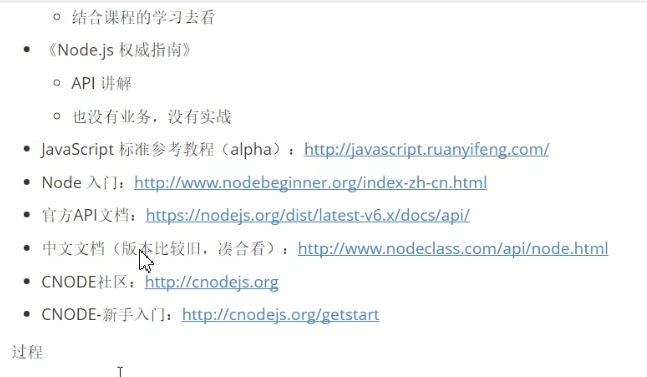

## 网站基本开发能力

服务端

前端

运维部署

# Node

## node.js 是什么

JavaScript运行时环境，解析和执行JavaScript代码，以前是浏览器做这件事

### 浏览器中JavaScript

- EcmaScript

  基本语法

  if

  var

  function

  Object

  Array

- DOM
- BOM

### Node.js中的JavaScript

- 没有BOM和DOM

- EcmaScript

- 为JavaScript提供了一些服务器级别的操作API

  文件读写

  网络服务的构建

  网络通信

  HTTP服务器等

### 构建在V8引擎上

- 引擎可以认识代码，解析执行它
- V8是最快的
- Node.js就是把V8移植出来，开发的一个JavaScript运行时环境

### 学习内容

就是API，不同用途的API

### Node.js的特点

- 事件驱动event-driven
- 非阻塞IO模型（异步）non-blocking I/O model
- 轻量高效lightweight and efficient

### Node.js开发的NPM

npm是世上最大的开源库生态系统

绝大多数JavaScript相关的包都放在npm上

## Node.js能做什么

- Web服务器后台

  命令行工具

  npm

  git（C）

  hexo（node）

  等

- 接口、游戏服务器等，其实就是第一个

- 对于前端来讲，接触最多的就是命令行工具

  webpack

  gulp

  npm

## 学习资源

## 学到什么

- B/S编程模型

  back-end

  Browser-Server

- 模块化编程

  以前都是使用script标签，在Node中可以像@import（）一样引用加载文件

- Node常用API

- 异步编程

  回调函数

  Promise

  async

  generator

- Express Web 开发框架

- ES6

### 1.读写文件

#### 踩坑1：一直读取失败

原因：运行的时候出现了上述的错误，原因就是fs模块读取文件的相对路径是以启动node.js的位置为基准的，而不是以js文件的位置

解决：更换启动位置，才可以使用相对路径，否则使用绝对路径

### 2.HTTP

#### 默认行为

加载收藏家图标：favicon.ico，就是标签页上的那个小图标