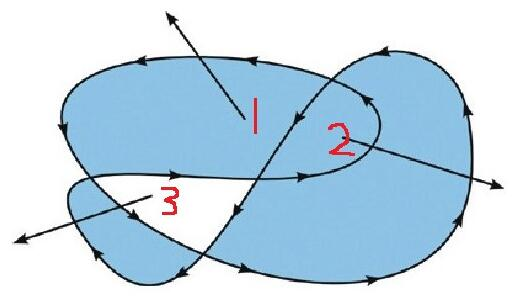

## canvas学习

#### 定义

画布，图形容器

#### 作用

图形绘制，通过JavaScript

#### canvas坐标系

#### 代码模板

<canvas id="tutorial" width="300" height="300"></canvas>

#### 具体实现布置

##### 1.准备画布

定义一个canvas标签

##### 2.准备绘制工具

获取上下文

##### 3.利用绘制工具画图

使用上下文中的属性和方法

### 具体内容

#### 1.画线

##### 要素：

起始点、终点、描边、填充、（宽度、颜色、线末端类型、拐点类型、虚线）

##### 顺序：

先画线，中间添加各种样式，最后描边或填充

起始位置：ctx.movetTo(x,y)

结束位置：ctx.lineTo(x,y)

结束位置可以有多个

##### 描边：ctx.stroke()

###### 修改描边的属性

颜色：ctx.strokeStyle='red'

宽度：ctx.lineWidth=10

线末端类型：ctx.lineCap='';[butt:默认，round:环绕，square:方形]

拐点类型：ctx.lineJoin='';[miter:默认，round:圆弧，bevel:斜面]

##### 填充：ctx.fill()

填充颜色：ctx.fillStyle='rgb(r,g,b)'

##### 填充规则：非零环绕

​    1.看一块区域是否填充

​    2.从这个区域拉一条直线

​    3.看和这条直线相交的轨迹

​    4.如果是顺时针的轨迹+1，逆时针-1

​    5.计算总和

​    6.如果是非0，那么该区域填充；是0，不填充

​    注；操作中，肯定选最少的线的那一面

##### 闭合路径

1.手动闭合:会有缺口问题（三角形）

2.程序闭合：closePath()，直接代替最后一条闭口线

##### 开启新路径：

beginPath()

目的：解决后面的描边对前面样式的覆盖问题

##### 关于线条的问题

​    1.默认的宽度是多少 1px ，但看起来有2px

​    线条的中线会对准刻度线，会把线分成0.5px,显示的时候回不饱和,实际占了两格，并且边缘会颜色变浅

​    解决方案：前后移动0.5px

​    2.默认的颜色是什么 黑色 但实际上是#7f7f7f，灰色

##### 虚线

###### 1.setLineDash()

描述虚线

​    参数是数组，描述排列方式

​    [5],实线5，虚线5

​    [5,10],实线5，虚线10

​    顺序描述排列，虚实相间

​    ctx.setLineDash([5, 10, 20]);

###### 2.getLineDash() 

获取虚线的排列方式,获取的是不重复的那一段排列方式

​    console.log(ctx.getLineDash());

###### 3.lineDashOffset 

设置虚线的偏移量（ 正值向左， 向上； 负值向右向下）

​    ctx.lineDashOffset = 20;

##### 绘制图形

1. ##### 绘制渐变色

   ​    颜色渐变的矩形

   ​    1.绘制矩形

   ​    2.填充颜色

   ​    3.黑到白的渐变

   ​    线是由点构成的

   ###### 示例：

   ​    ctx.lineWidth = 40;

   ​    for (var i = 0; i < 255; i++) {

   ​      ctx.beginPath();

   ​      ctx.moveTo(100 + i, 100);

   ​      ctx.lineTo(101 + i, 100);

   ​      ctx.strokeStyle = 'rgb(' + i + ',' + i + ',' + i + ')';

   ​      ctx.stroke();

   ​    }

2. ##### 绘制网格

   1.网格大小

   2.横线条数

   3.竖线条数

   4.遍历画线

   注意：每次画线，开启新路径，并描边

3. ##### 绘制坐标系

   1.确定原点

   2.确定原点到画布边缘的距离

   3.确定坐标轴的长度

   4.确定箭头大小，是个等腰三角形，确定底和高 10

   5.绘制箭头填充

4. ##### 绘制坐标点

   1. 点的尺寸

   2. 以坐标中心绘制点

5. ##### 绘制折线图

   把2,3,4三步合起来，需要另外做两件事：

   1.数据的坐标需要转换为canvas坐标

   2.把点用线连起来

#### 2.画图形

##### 1.绘制矩形

​    // 绘制矩形路径 不是独立路径，没有beginPath；

​    ctx.rect(100, 100, 200, 100);

​    ctx.stroke();

​    ctx.fillStyle = 'red';

​    ctx.fill();

​    // 绘制矩形，有独立路径,描边

​    ctx.strokeRect(200, 200, 150, 150);

​    // 绘制矩形，有独立路径,填充

​    ctx.fillRect(200, 200, 55, 50);

​    // 清除矩形区域

​    ctx.clearRect(0, 0, 150, 150);

###### 渐变色矩形

  // x0,y0,x1,y1

​    var linearGradient = ctx.createLinearGradient(100, 100, 500, 100);

​    linearGradient.addColorStop(0, 'pink');

​    linearGradient.addColorStop(0.3, 'green');

​    linearGradient.addColorStop(1, 'blue');

​    ctx.fillStyle = linearGradient;

​    ctx.fillRect(100, 100, 400, 100);

​    // 由pink到blue

​    // 通过两个点坐标可以控制，渐变方向

##### 2.绘制弧度

​    1.什么是弧度

​    弧长对应的圆心角的角度

​    2.一个弧度怎么描述

​    弧长等于半径的弧，其所对的圆心角为1弧度

​    3.一弧度有多长

​    半径长度

​    一个角度=π/180

###### 曲线绘制

​    1.体验曲线的绘制

​    2.线是由点构成的

​    3.曲线可以由数学公式得来

###### 绘制圆弧

ctx.arc(x,y,radius,startAngle,endAngle,direction)

​    1.确定圆心 坐标x,y

​    2.确定圆的半径

​    3.确定起始位置和结束位置，确定弧的长度和位置 startAngle endAngle,以X轴方向为0度

​    4.确定绘制的方向，direction：顺时针（默认）：false；逆时针：true

###### 画圆

即填充圆心和圆弧

加个ctx.moveTo(x,y),圆心坐标即可

##### 随机颜色函数

​    function getRandomColor() {

​      var r = Math.floor(Math.random() * 256);

​      var g = Math.floor(Math.random() * 256);

​      var b = Math.floor(Math.random() * 256);

​      return 'rgb(' + r + ',' + g + ',' + b + ')';

​    }

#### 3.绘制文字

描边文字

​    ctx.strokeText(str, x0, y0);

填充文字

​    ctx.fillText(str, 100, 100);

文本属性：

​    1.font：尺寸，字体

​    ctx.font = '30px Microsoft YaHei';

​    2.左右对齐方式,基于起点坐标对齐

​    // textAlign:左（默认left），右（right），中心（center），start，end

​     ctx.textAlign = 'center';

​    3.垂直对齐方式,基于起点坐标对齐，默认基线对齐：top,bottom,middle

​    ctx.textBaseline='middle';

获取文字的宽度

​    var width=ctx.measureText(str).width;

#### 绘制饼状图

​    1.根据数据绘制饼图

​    2.绘制标题，从扇形的弧的中心伸出一条线，再画一条横线，在横线的上面写上标题文字

​    3.在画布左上角绘制说明，一个和扇形颜色一样的矩形，旁边的是文字说明

##### 实现步骤

1. 数据转化为弧度

2. 画饼图

   确定圆心，画弧并填充随机色，当前的结束弧度要等于下一次的起始弧度，遍历

3. 绘制伸出去的线

   ​      1.确定伸出去的线，通过圆心 、通过伸出去的点

   ​      2.确定伸出去的点，需要确定伸出去的线的长度

   ​      3.固定伸出去的线的长度

   ​      4.计算这个点的坐标

   ​      5.根据角度和斜边的长度

   ​      5.1 使用弧度 当前扇形的起始弧度+对应的弧度的一半

   ​      5.2 半径+伸出去的长度

   ​      5.3 outX=x0+cos(angle)*(radius+outline)

   ​      5.4 outY=x0+sin(angle)*(radius+outline)

4. 画文字和横线

   ​      线的方向怎么判断 伸出去的点在x0的左边，线的方向就是左边

   ​      线的方向怎么判断 伸出去的点在x0的右边，线的方向就是右边

   ​      结束的点坐标 和文字大小有关

5. 画矩形和文字

   矩形的大小

   距离上边和左边的间距

   矩形之间的间距

#### 4.画图片

1.创建对象

2.绑定加载完成事件

3.设置图片路径

  var img = new Image();

  // 如果onload放在src的后面，可能会导致函数不执行；因为图片已经加载完毕

  img.onload = function() {

​    // 实现图片绘制

​    // 三种方式

##### 1.drawImage(图片,x,y)起始坐标

​    ctx.drawImage(img, 0, 0);

​    console.log(img);

##### 2.drawImage(img,x,y,width,height),图片大小（缩放）

​    ctx.drawImage(img, 0, 0, 300, 300);

##### 3.drawImage(img,x,y,width,height,x1,y1,w1,h1)

​    // x,y,width,height:图片以原始尺寸展示时，截取图片上的一个矩形

​    // x1,y1,w1,h1：截取到的矩形，以这个位置尺寸来展示，并进行缩放

​    ctx.drawImage(img, 0, 0, 300, 300, 0, 0, 290, 290);

  }

  img.src = 'images/1.jpg';

  // 必须等图片加载完毕，才能使用

##### 帧动画

通过定时器，不断切换精灵图的位置

###### 清空矩形区域      

ctx.clearRect(x, y,width, height);

##### 行走的小人

1.通过方向键控制行走，切换不同的图片，并移动位置

2.确定步长、行走方向

3.确定起始位置、方向

4.每次触发时注意清空画布

#### canvas转换

**转换的始终是坐标轴**

- 平移 移动画布的原点
  + translate(x,y) 参数表示移动目标点的坐标
- 缩放
  + scale(x,y) 参数表示宽高的缩放比例
- 旋转
  + rotate(angle) 参数表示旋转角度