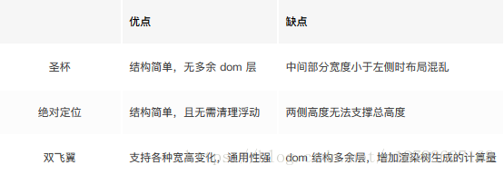

# 前端汇总

## HTML

### 1.常用图片格式

JPEG:最流行，可以有损压缩到最小

GIF：动图，有意思

png：画面最好

png是便携式网络图片（Portable Network Graphics）是一种无损数据压缩位图文件格式.优点是：压缩比高，色彩好。 大多数地方都可以用。

jpg是一种针对相片使用的一种失真压缩方法，是一种破坏性的压缩，在色调及颜色平滑变化做的不错。在www上，被用来储存和传输照片的格式。

gif是一种位图文件格式，以8位色重现真色彩的图像。可以实现动画效果.

webp格式是谷歌在2010年推出的图片格式，压缩率只有jpg的2/3，大小比png小了45%。缺点是压缩的时间更久了，兼容性不好，目前谷歌和opera支持。

### 2.请简述盒模型

从内而外：内容，内边距，边框，外边距，

三种计算方式：box-sizing

box-sizing：content-box     //padding和border会撑开盒子，额外加尺寸

box-sizing：border-box     //不会，height=content+border+padding

box-sizing：inherit    //继承父亲的值

### 3.音视频标签

视频：video

格式：MP4，ogv，webm

属性：src，width/height，autoplay，

controls：是否显示控制条

loop：是否循环播放

muted：静音模式

poster：播放之前显示的展位图片

音频：audio

格式：MP3，ogg，WAV

同上，但宽高，poster不能用

音视频：embed


### 4.HTML5新增内容

#### 1、语义化标签

##### 优点：1.提升可访问性；2.SEO；3.结构清晰，利于维护

header

footer

main

nav

aside

article

section

hgroup

figure

figcaption

time

mark

dialog

embed

video

audio


#### 2、表单类型


#### 3、表单元素

#### 4、表单属性


#### 5、多媒体标签

### 5.CSS3新增特性

#### 1、边框

border-radius添加圆角边框       

border-shadow：给框添加阴影 （水平位移，垂直位移，模糊半径，阴影尺寸，阴影颜色，insetr（内/外部阴影））

border-image：设置边框图像

border-image-source 边框图片的路径

border-image-slice 图片边框向内偏移

border-image-width 图片边框的宽度

border-image-outset 边框图像区域超出边框的量

border-image-repeat 图像边框是否平铺（repeat平铺 round铺满 stretch 拉伸）

#### 2、背景

Background-size 背景图片尺寸

Background-origin规定background-position属性相对于什么位置定位

Background-clip 规定背景的绘制区域（padding-box，border-box，content-box）

#### 3、渐变

Linear-gradient（）线性渐变

Radial-gradient（）径向渐变

#### 4、文本效果

Word-break：定义如何换行

Word-wrap：允许长的内容可以自动换行

Text-overflow：指定当文本溢出包含它的元素，应该干啥

Text-shadow：文字阴影（水平位移，垂直位移，模糊半径，阴影颜色）

#### 5、转换

Transform 应用于2D3D转换，可以将元素旋转，缩放，移动，倾斜

Transform-origin 可以更改元素转换的位置，（改变xyz轴）

Transform-style 指定嵌套元素怎么样在三位空间中呈现

##### 2D转换方法

rotate旋转 

translate（x，y）指定元素在二维空间的位移

scale（n）定义缩放转换

##### 3D转换方法

Perspective（n）为3D转换 translate rotate scale

##### 注意：

1. 同时使用多个转换，其格式为：transform: translate() rotate() scale()……等
2. 其顺序会影响转换的效果（先旋转会改变坐标轴的方向）
3. **当我们同时有位移和其他属性的时候，记得要将位移放到最前面**

#### 6、过渡

Transition-property过渡属性名

Transition-duration 完成过渡效果需要花费的时间

Transition-timing-function 指定切换效果的速度

Transition-delay 指定什么时候开始切换效果

transition:要过渡的属性 花费时间 运动曲线 何时开始

属性	描述	CSS
transition					简写属性，用于在一个属性中设置四个过渡属性。	
transition-property	规定应用过渡的 CSS 属性的名称。属性就是你想要变化的 css 属性， 宽度高度 背景颜色 内										外边距都可以 。如果想要所有的属性都变化过渡， 写一个all 就可以。	
transition-duration	定义过渡效果花费的时间(必须写单位)。默认是 0。	
transition-timing-function	规定过渡效果的时间曲线。默认是 “ease”。	
transition-delay			规定过渡效果何时开始，可以设置 延迟触发时间。默认是 0，鼠标触发就立即开始。	


样例：

```
div {
		width: 200px;
		height: 100px;
		background-color: pink;
		/* transition: 要过渡的属性  花费时间  运动曲线  何时开始; */
		/* transtion 过渡的意思  这句话写到div里面而不是 hover里面 
		过渡写到本身上，谁做动画，给谁加*/
		transition: width 0.6s ease 0s, height 0.3s ease-in 1s;
		


}
div:hover {  /* 鼠标经过盒子，我们的宽度变为400 */

			width: 600px;
			height: 300px

}

transition: all 0.6s;  /* 所有属性都变化用all 就可以了  后面俩个属性可以省略 */
```

#### 7、动画

Animation-name 为@keyframes动画名称

animation-duration 动画需要花费的时间

animation-timing-function 动画如何完成一个周期

animation-delay 动画启动前的延迟间隔

animation-iteration-count 动画播放次数

animation-direction 是否轮流反向播放动画

##### 制作动画分为两步：

1-先用keyframes定义动画(类似定义类选择器)
动画序列
0%是动画的开始，100%是动画的完成，这样的规则就是动画序列
在**@keyframes**中规定某项CSS样式，就能创建由当前样式逐渐改为新样式的动画效果
动画是使元素从一种样式逐渐便化为另一种样式的效果，你可以改变任意多的样式任意多的次数。
请用百分比来规定变化发生的时间，或用关键词 " form " 和 ‘’ to " ，等同于0%和100%

```css
	@keyframes 动画名称 { 	
        0%{ 		width: 100px; 	} 	
        100%{ 		width: 200px; 	}    
    }
```

2-再使用（调用）动画

```
  div{
       width: 200px;
       height: 200px;
       background-color: green;
       margin: 100px auto;
       /* 调用动画 */
       animation-name: 动画名称;
       /* 持续时间 */
       animation-duration: 持续时间;
   }

```

##### 常用属性


##### 动画简写属性

animation：动画名称 持续时间 运动曲线 何时开始 播放次数 是否反方向 动画起始或者结束的状态；
animation: name duration timing-function delay iteration-count direction fill-mode;

简写属性里面不包含animation-play-state，如需使用，单独写
暂停动画：animation-play-state：puased;经常和鼠标经过等其他配合使用
想要动画走回来，而不是直接就回来：animation-direction: alternate
盒子动画结束后，停在结束位置：animation-fill-mode: forwards

##### 案例

```
<!DOCTYPE html>
<html lang="en">
<head>
    <meta charset="UTF-8">
    <meta name="viewport" content="width=device-width, initial-scale=1.0">
    <title>热点图</title>
    <style>
        body{
            background-color: #333;
        }
        .map{
            position: relative;
            width: 747px;
            height: 616px;
            margin: 0 auto;
            background: url('media/map.png') no-repeat;
        }
        .city{
            position: absolute;
            top: 227px;
            right: 191px;
        }
        .tb{
            top: 499px;
            right: 80px;
        }
        .dotted{
            width: 8px;
            height: 8px;
            border-radius: 50%;
            background-color: #09f;
        }
        div[class^='pulse']{
            position: absolute;
            top: 50%;
            left: 50%;
            width: 10px;
            height: 10px;
            transform: translate(-50%, -50%);
            border-radius: 50%;
            box-shadow: 0 0 12px #009dfd;
            animation: pulse 1.2s linear infinite;
        }
        .city .pulse2{
            animation-delay: 0.4s;
        }
        .city .pulse3{
            animation-delay: 0.8s;
        }
        @keyframes pulse {
            0%{}
            70%{
                /* 用scale会导致阴影也放大 */
                /* transform: scale(2); */
                width: 40px;
                height: 40px;
                opacity: 1;
            } 
            100%{
                width: 70px;
                height: 70px;
                opacity: 0;
            }
        }
    </style>
</head>
<body>
    <div class="map">
        <div class="city">
            <div class="dotted">
                <div class="pulse1"></div>
                <div class="pulse2"></div>
                <div class="pulse3"></div>
            </div>
        </div>
        <div class="city tb">
            <div class="dotted">
                <div class="pulse1"></div>
                <div class="pulse2"></div>
                <div class="pulse3"></div>
            </div>
        </div>
    </div>
</body>
</html>
```


###### 速度曲线细节

animation-timing-function：规定动画的速度曲线，默认是ease


##### 注意事项：

before 和 after 必须有 content 属性
before 在内容前面，after 在内容后面
before 和 after 创建的是一个元素，但是属于行内元素
创建出来的元素在 Dom 中查找不到，所以称为伪元素
伪元素和标签选择器一样，权重为 1
典型应用：
添加字体图标

### 6.清除浮动的方式有哪些？请说出各自的优缺点

#### 目的

**为了解决，父元素因为子级元素浮动引起的内部高度为0的问题，即高度塌陷**

#### 1、给父盒子设定高度

优点：快速简单

缺点：无法进行响应式布局

#### 2、额外标签法

在最后一个浮动标签后，新加一个标签，给其设置clear：both；

优点：通俗易懂，书写方便

缺点：添加许多无意义的标签，结构化较差

#### 3、父级添加overflow属性（父元素添加overflow:hidden）

优点：  代码简洁

缺点：  内容增多时候容易造成不会自动换行导致内容被隐藏掉，无法显示需要溢出的元素。

#### 4、使用after伪元素清除浮动

```css
 .clearfix:after {  content: "."; display: block; height: 0; clear: both; visibility: hidden;  }   

 .clearfix {*zoom: 1;}   /* IE6、7 专有 */
```

优点： 符合闭合浮动思想  结构语义化正确

缺点： 由于IE6-7不支持:after，使用 zoom:1触发 hasLayout。

#### 5、使用before和after双伪元素清除浮动

```css
.clearfix:before,.clearfix:after { 
  content:"";
  display:table;  /* 这句话可以出发BFC BFC可以清除浮动,BFC我们后面讲 */
}
.clearfix:after {
 clear:both;
}
.clearfix {
  *zoom:1;
}
```

优点：  代码更简洁

缺点：  由于IE6-7不支持:after，使用 zoom:1触发 hasLayout。

### 7.定位的属性值有何区别

Position有四个属性值：relative absolute fixed static

Relative相对定位 不脱离文档流，相对于自身定位

Absolute 绝对定位，脱离文档流 相对于父级定位

Fixed 固定定位，脱离文档流，相对于浏览器窗口定位

Static 默认值，元素出现在正常的流中

### 8.子元素如何在父元素中居中

#### 水平居中：

1.子父元素宽度固定，子元素设置margin：auto，并且子元素不能设置浮动，否则居中失效

2.子父元素宽度固定，父元素设置text-align：center，子元素设置display：inline-block，并且子元素不能设置浮动，否则居中失效

##### 子元素为行内元素：

父元素设置text-align：center

##### 子元素为块级元素：

**方案一：(分宽度定不定两种情况)**

**定宽度：**需要谁居中，给其设置 ***\*margin: 0 auto;\**** （作用：使盒子自己居中）

 **不定宽度：**默认子元素的宽度和父元素一样，这时需要设置子元素为***\*display: inline-block;\**** 或 ***\*display: inline;\****即将其转换成行内块级/行内元素，给父元素设置 **text-align: center;** 

**方案二：使用定位属性**

首先设置父元素为相对定位，再设置子元素为绝对定位，设置子元素的**left:50%**，即让子元素的左上角水平居中；

**定宽度：**设置绝对子元素的 ***\*margin-left: -元素宽度的一半px;\**** 或者设置**transform: translateX(-50%);**

**不定宽度：**利用css3新增属性**transform: translateX(-50%);**

**方案三：使用flexbox布局实现（宽度定不定都可以）**

使用flexbox布局，只需要给待处理的块状元素的父元素添加属性 **display: flex; justify-content: center;**

#### 垂直居中：

- ##### **单行的行内元素**

只需要设置单行行内元素的"行高等于盒子的高"即可；

- **多行的行内元素**

使用给父元素设置**display:table-cell;**和**vertical-align: middle;**属即可；

#####  **块级元素**

**方案一：使用定位**

首先设置父元素为相对定位，再设置子元素为绝对定位，设置子元素的**top: 50%**，即让子元素的左上角垂直居中；

**定高度：**设置绝对子元素的 ***\*margin-top: -元素高度的一半px;\**** 或者设置**transform: translateY(-50%);**

**不定高度：**利用css3新增属性**transform: translateY(-50%);**

**方案二：使用flexbox布局实现（高度定不定都可以）**

使用flexbox布局，只需要给待处理的块状元素的父元素添加属性 **display: flex; align-items: center;**

#### 水平垂直居中：

1. 子元素相对于父元素绝对定位，子元素top，left设置50%，子元素margin-top和margin-left减去各自宽高的一半
2. 子元素相对于父元素绝对定位，子元素上下左右全为0，然后设置子元素margin：auto
3. 父元素设置display：table-cell vertical-align：middle，子元素设置margin：auto
4. 子元素相对定位，子元素top，left值为50%，transform：translate（-50%，-50%）
5. 子元素相对父元素绝对定位，子元素top，left值为50%，transform：translate（-50%，-50%）
6. 父元素设置弹性盒子，
7. display：flex； justfy-content：center ；align-item：center； 

### 9.css3绘制三角形

```css
        /* css3绘制三角形 */
        .triangle{
            width: 0px;                           /*设置宽高为0，所以div的内容为空，从才能形成三角形尖角*/
            height: 0px;
            border-bottom: 200px solid #00a3af;
            /* border-top: 200px solid #00a3af; */
            border-left: 200px solid transparent;    /*transparent 表示透明*/
            border-right: 200px solid transparent;
        }
```


### 10.如何让Chrome显示小于12px的文字

 针对谷歌浏览器内核，加webkit前缀，用transform:scale()这个属性进行缩放

-webkit-transform:scale(0.8)

### 11.选择器优先级

优先级（权重）：

元素选择器1

伪元素选择器1

class选择器10

伪类选择器10

属性选择器10

Id选择器100

内联样式的权重1000

！impotent   无穷大

### 12.网页中有大量图片加载很慢 你有什么办法进行优化？

1.图片懒加载，在图片未可视区域加一个滚动条事件，判断图片位置与浏览器顶端和页面的距离，如果前者小于后者，优先加载

2.使用图片预加载技术，将当前展示图片的前一张和后一张优先下载

3.使用csssprite或者svgsprite（即使用精灵图，把所有小图片都放到一个大图片中去），减少请求次数

4.压缩文本和图片

压缩技术如 gzip 可以有效减少页面加载的时间。压缩率都可以在大小 70%左右。虽然文本压缩用得比较多，但图片的压缩就比较随意，很多都是直接上传，其实还有很大的压缩空间。

5.确保功能图片优先加载

先加载图片再加载其它，会使用户体验感好。但速度不会提升

6.图片格式优化

不恰当的图像格式是一种极为常见的减慢加载速度的罪魁祸首。正确的图片格式可以让图片缩小数倍，如果保存为最佳格式。可以节省大量带宽，减少处理时间时间，大大加快页面加载速。

7.使用 Progressive JPEGs
Progressive JPEGs 图片是 JPEG 格式的一个特殊变种，名为“高级 JPEG”。在创建高级 JPEG 文件时，数据是这样安排的：在装入图像时，开始只显示一个模糊的图像，随着数据的装入，图像逐步变得清晰。它相当于交织的 GIF。

### 12.行内元素/块级元素有哪些？

行内元素：相邻的行内元素会排列在同一行，不会独占一行 设置宽高无效 span

块级元素：会独占一行 可以设置宽高等属性div

可变元素：根据上下文预警决定该元素为块元素还是内联元素

块级元素：div h1-h6 hr p ul ol table address blockquote dir from menu

行内元素：a br I em img input select span sub sup u textarea

可变元素：button del iframe ins

### 13.浏览器的标准模式和怪异模式区别？

标准模式：浏览器按照W3C标准解析执行代码

怪异模式：浏览器根据自己的方式解析执行代码，因为不同浏览器解析执行方式不一样，所以叫怪异模式

#### 区别：

1. 在怪异模式下，盒模型为怪异盒模型 而在标准模式下为标准盒子模型
2. 图片元素的垂直对齐方式     对于行内元素和table-cell元素，标准模式下vertical-align属性默认值是baseline，而在怪异模式下，table单元格中的图片的vertical-align属性默认值是bottom，因此在图片底部会有几像素的空间
3. 元素中的字体         css中font的属性都是可以继承的，怪异模式下，对于table元素，字体的某些元素不能从其他封装元素继承中得到，特别是font-size属性
4. 内联元素的尺寸     标准模式下，non-replaced inline元素无法自定义大写，怪异模式下，定义元素的宽高会影响元素的尺寸
5. 元素的百分比高度         当一个元素使用百分比高度时，在标准模式下，高度取决于内容变化，在怪异迷失下，百分比被准确应用
6. 元素溢出的处理              标准模式下，overflow取值默认值为visible，在怪异模式下，这个溢出会被当做扩展box对待，就是元素的大小由内容决定，溢出不会裁剪，元素框自动调整，包含溢出内容

### 14.弹性盒子布局属性有那些请简述?

Flex-direction：弹性容器中子元素排列方式（主轴排列方式）

Flex-wrap：设置弹性盒子的子元素超出父容器时是否换行

Flex-flow：是flex-direction和flex-wrap简写形式

Align-item：设置弹性盒子元素在侧轴上的对齐方式

Align-content：设置行对齐

Justify-content：设置弹性盒子元素在主轴上的对齐方式

### 15.怎么实现标签的禁用

添加disabled属性

### 16.Flex布局原理

就是通过给父盒子添加flex属性，来控制子盒子的位置和排列方式

### 17.px，rem，em,vw 和 vh的区别

Px，绝对长度单位，像素px是相对于显示器屏幕分辨率来说的

em: 相对长度单位，相对于当前对象内文本的字体尺寸

​     em的值并不是固定的

​     em会继承父级元素的字体大小（参考物是父元素的font-size）

​     em中所有的字体都是相对于父元素的大小决定的

rem :相对于html根元素的font-size

rem的缺点：小说网站，屏幕越小的移动设备如果用了rem肯定文字就越小，就会导致看文章的时候特别费眼

1em=1rem=16px 在body中加入font-size：62.5% 这样直接就是原来的px数值除以10加上em就可以

vw,vh  :全称是 Viewport Width 和 Viewport Height，视窗的宽度和高度，相当于
屏幕宽度和高度的 1%，不过，处理宽度的时候%单位更合适，处理高度的
话 vh 单位更好。

### 18.请简述媒体查询

#### 定义

媒体查询是向不同设备提供不同样式的一种方式，它为每种类型的用户提供了最佳的体验。
css2: media type media type(媒体类型)是css 2中的一个非常有用的属性，通过media type我们可以对不同的设备指定特定的样式，从而实现更丰富的界面。
css3: media query media query是CSS3对media type的增强，事实上我们可以将media query看成是media type+css属性(媒体特性Media features)判断。

#### 使用

link标签引入：media属性（eg：引入（screen）彩色屏幕显示，并且最大宽度不超过800px时候的CSS样式）

```html
<link rel="stylesheet" media="screen and (max-width:800px)" href="./demo.css">
```

媒体类型（Media Type):  all(全部)、screen(屏幕)、print(页面打印或打印预览模式)
媒体特性（Media features): width(渲染区宽度)、device-width(设备宽度)... Media Query是CSS3 对Media Type的增强版，其实可以将Media Query看成Media Type(判断条件)+CSS(符合条件的样式规则)
style中直接引入：当显示宽度不大于400px时，div该有的样式。

```css
@media screen and (max-width: 400px) {
.wrapper div{
width: 100%;
}
}
```

#### 属性

**媒体类型(media type) ：常用all，screen，print**



**媒体特性(media features) ：**


逻辑操作符 and：

合并多个媒体属性

eg：@media screen and (min-width: 600px) and (max-width:100px)

合并多个媒体属性或合并媒体属性与媒体类型, 一个基本的媒体查询，即一个媒体属性与默认指定的screen媒体类型

指定备用功能：

eg：@media screen and (min-width: 769px), print and (min-width: 6in)"

没有or关键词可用于指定备用的媒体功能。相反，可以将备用功能以逗号分割列表的形式列出，这会将样式应用到宽度超过769像素的屏幕或使用至少6英寸宽的纸张的打印设备。（逗号代表或）

指定否定条件：

eg：@media not screen and (monochrome)

要指定否定条件，可以在媒体声明中添加关键字not，不能在单个条件前使用not。该关键字必须位于声明的开头，而且它会否定整个声明。所以，上面的示例会应用于除单色屏幕外的所有设备。

#### 注意：

device-width/height    width/height来做为的判定值

device-width/height 是设备的宽度（如电脑手机的宽度，不是浏览器的宽度）

width/height使用documentElement.clientWidth/Height即viewport的值。

### 19.三栏布局方式--两边固定中间自适应

1. margin负值法：左右两栏均左浮动，左右两栏采用负的margin值。中间栏被宽度为100%的浮动元素包起来
2. 自身浮动法：左栏左浮动，右栏右浮动，中间栏放最后
3. 绝对定位法：左右两栏采用绝对定位，分别固定于页面的左右两侧，中间的主体栏用左右margin值撑开距离。

   4.flex  左右固定宽  中间flex：1

   5.网格布局

6. table布局

7. 对中间的宽度进行calc计算 

  三个元素都向左浮动，左右定宽，中间的对其进行计算，让100%宽度减去左右宽度，即为中间宽度。

  ```html
  <!DOCTYPE html>
  <html>
  	<head>
  		<meta charset="UTF-8">
  		<title></title>
  		<style type="text/css">
  			.container{
  				overflow: hidden;
  			}
  			.left,.right{
  				float: left;
  				width: 100px;
  				background:red;
  			}
  			.center{
  				float: left; 
  				width:calc(100% - 200px);
  				background:yellow;
  			}
  		</style>
  	</head>
  	<body>
  	    <div class="container">
  		<div class="left">left</div>
  	        <div class="center">center</div>
  	        <div class="right">right</div>
  	    </div>
  	</body>
  </html>
  ```

  8.双飞翼布局

    目的：为了优先显示中间主要部分，浏览器渲染引擎在构建和渲染渲染树是异步的（谁先构建好谁先显示），故在编写时，先构建中间main部分，但由于布局原因，将left置于center左边，故而出现了双飞翼布局。

  9.圣杯布局

  padding是在实际内容content之外的，内部子元素设置margin只能在这个content区域内

   圣杯布局的缺点：正常情况下是没有问题的，但是特殊情况下就会暴露此方案的弊端，如果将浏览器无线放大时，「圣杯」将会「破碎」掉。如图，当main部分的宽小于left部分时就会发生布局混乱。

  

### 20.三栏布局方式--两边自适应中间固定

#### 1.css3布局

​    目前没有浏览器支持 box-flex 属性。Firefox 支持替代的 -moz-box-flex 属性。Safari、Opera 以及 Chrome 支持替代的 -webkit-box-flex 属性。

box-flex 属性规定框的子元素是否可伸缩其尺寸。提示：可伸缩元素能够随着框的缩小或扩大而缩写或放大。只要框中有多余的空间，可伸缩元素就会扩展来填充这些空间。

```html
<!DOCTYPE html>
<html>
    <head>
        <meta charset="UTF-8">
        <title></title>
        <style type="text/css">
            div[class=me] { 
                display: -webkit-box;
            }
            div div { 
                background: red; 
                height: 100px;
            }
            div div:nth-child(1) {
                -webkit-box-flex:1;
            }
            div div:nth-child(2) { 
                width: 800px; 
                background: #ccc;
            }
            div div:nth-child(3) {
                -webkit-box-flex:1;
            }
        </style>
    </head>
    <body>
        <div class="me">
            <div>left</div>
            <div>center</div>
            <div>right</div>
        </div>
    </body>
</html>
```

#### 2.flex布局

```html
<!DOCTYPE html>
<html>
	<head>
		<meta charset="UTF-8">
		<title></title>
		<style type="text/css">
			*{
				margin:0;
				padding:0;
			}
			.wrap{
				display:flex;
				flex-direction:row;
				margin-top:20px;
			}
			.center{
				width:800px;
				text-align:center;
				background:#ccc;
			}
			.left,.right{
				/*flex-grow 属性用于设置或检索弹性盒的扩展比率。*/
	                        flex-grow: 1;
	                        line-height: 30px;
	                        background:red;
	                }
		</style>
	</head>
	<body>
		<div class="wrap">
			<div class="left">left</div>
			<div class="center">center</div>
			<div class="right">right</div>
		</div>
	</body>
</html>
```

#### 3.左右利用calc()函数计算

```html
<!DOCTYPE html>
<html>
	<head>
		<meta charset="UTF-8">
		<title></title>
		<style type="text/css">
			#container{
				height:200px;
				width: 100%;
			}
			
			#left,#right{
				float:left;
				background-color:#ccc;
				height:100%;
				width: calc(50% - 500px);
			}
			#center{
				float:left;
				background-color:yellow;
				height:100%;
				width:1000px;
			}
		</style>
	</head>
	<body>
		<div id="container">
			<div id="left">left</div>
			<div id="center">center</div>
			<div id="right">right</div>
		</div>
	</body>
</html>
```

### 21.Doctype的作用

声明文档类型，h5

### 22.如何把光标定位到某一个控件

​                this.tbUsername.Focus();

### 23.button按钮和div按钮有什么区别

button具有默认样式
button在表单中具有默认的提交事件
button具有disabled属性可以禁用

### 24.百度、淘宝、京东移动端首页秒开是如何做到的？

策略有几个要点：
1.首屏内容静态化在html里面，直接DOMParse时渲染出来；
2.紧邻首屏的内容，如果不能包含在html中静态化，那么可以让在在页面渲染后，立刻执行异步获取数据（这里有一个注意项，jquery的初始化比较慢，观察有200ms以上的时间，也就是说jquery是在200ms以后才开始执行$(function(){})里面的语句)；
3.对于再往底部的内容可以采用div级别的懒加载；
4.页面中的图片采用img懒加载（首屏直接相关的可以除外）。

### 25.请说说使用iconfont图标的优点和缺点

#### 优点：

减少请求次数，将多个 icon 合并到一个字体文件中，从而提高网页性能；
自由的变化大小和颜色，因为字体是可以通过样式来设置大小和颜色的；
矢量图不失真；
适合多平台（浏览器、iOS App、Android App）；

#### 缺点：

单色
维护成本高

### 26.清除a,li的默认样式

a:   text-decoration: none;

li:   list-style:none

### 27.举例说明只用html和css如何使得一个列表编号倒序？

```html
<!DOCTYPE html>
<html>
<body>
<style>
ol{
display: flex;
flex-wrap: wrap-reverse
}
li{
width: 100%
}
</style>
<ol>
  <li>咖啡</li>
  <li>牛奶</li>
  <li>茶</li>
</ol>
 
</body>
</html>

```

### 28.网页中的友情链接有什么作用？

有利于SEO，提高访问量,精准访问

### 29.如何让pre标签中的元素自动换行？

pre{
  white-space:pre-wrap; /* css3.0 /
  white-space:-moz-pre-wrap; / Firefox /
  white-space:-pre-wrap; / Opera 4-6 /
  white-space:-o-pre-wrap; / Opera 7 /
  word-wrap:break-word; / Internet Explorer 5.5+ */
}

### 30.在两个iframe之间传递参数的方法有哪些

    通过postMessage与父级通过，父级传递消息
    通过websocket通信
    如果是同一个域名下
    
    可用stroage，监听storageChange事件通信
    通过web worker也可通信

### 31.怎样使用iframe刷新父级页面？

 //在父页面中
  window.addEventListener("message",function(e){
      if(e.data.reload){
           winodw.location.reload()
      }

  }, false);
  //在子页面中
  window.parent.postMessage({reload:true})

### 32.为什么移动端页面的设计稿一般是750px/640px呢？

750px 代表iphone6或inphone6s 设备的像素(宽)
640px 代表inpone3Gs，inpone4/4s iphone5系列 设备的像素(宽)
其他手机大多数时这两种规格
750px/640px 代表的逻辑像素是 375px/320px，简称2.x 图；所以实际上写css像素时，要除以2

### 33. iframe在更改了src之后，不出现后退或者前进按钮怎么解决？

更改src时可以先删除旧的iframe后，新建一个iframe设置好src添加进去

### 34.iframe如何自动调整高度？

未跨域时，在iframe中利用他的父窗口对象将本页面的滚动高度设置给iframe的height
跨域时，在iframe中将自己的的滚动高设置在本页面内的一个隐藏于父页面不跨域的iframe的hash值，
在隐藏的iframe中将值取出，同未跨域一样设置到要自动调节高度的iframe的height

### 35.如何禁止web端的页面缩放

  <meta name="viewport" content="width=device-width, initial-scale=1.0, maximum-scale=1.0, user-scalable=no">

.其实还有个取巧的办法就是 rem，一般还会设 body 为 12 或 24，
当不设时，不管怎么缩放，样式也跟着缩放，就跟没变一样了。

### 36.对一个元素设置浮动后，它的特征是什么？

    浮动元素脱离正常的文档流
    浮动元素后的内联元素，将围绕在浮动元素周围
    浮动元素会造成父元素的高度坍塌

### 37.IE6文字溢出BUG（别名：多出来的猪、谍影重重）怎么解决呢？

删除注释或不设置浮动

### 38.请说说你在写布局时对于浏览器兼容性的感受或总结

要選用某種方式,table，flex，float，定位來完成某一部分的佈局時，不要忘了是要跑在什麼瀏覽器以及設備上，比如定位在ios上是有些坑的，flex兼容性也並不是特別好；選擇好佈局方式後考慮佈局容器中元素的換行，超出情況，比如浮動元素超出後跑到下面

### 39.写html代码时，怎样才加速写代码的速度呢？你有什么方法？

    基于之前项目，整理出标准化方案。调研技术方案，提取可复用组件，方法等
    写代码前整理业务思路流程，先思考，后写码。

### 40.你觉得新开发一个网站最困难的是哪些部分？

提高网站安全性，比如网站有论坛方面的功能，那需要保证不让黑客通过拦截请求信息，发起对论坛信息的破解。在比如DOS 攻击

### 41.页面的重绘和回流是什么

    由于节点的几何属性发生改变或者由于样式发生改变而不会影响布局的，称为重绘。
    回流是布局或者几何属性需要改变就称为回流。

回流必定会发生重绘，重绘不一定会引发回流。

### 42.如何关闭HTML页面在IOS下的键盘首字母自动大写

autocapitalize="none"或"off"

### 43.一般习惯把js写在＜/body＞前，但有例外的情况吗？说说看

计算机读代码的顺序是从上往下读的,html文件中的顺序是<head>→<body>→body后方

javascript代码写在<head>里面：

由于这时候网页主体（body）还未加载，所以这里适合放一些不是立即执行的自定义函数，立即执行的语句则很可能会出错（视浏览器而定）

javascript代码写在<body>里面：

这里可以放函数也可以放立即执行的语句，但是如果需要和网页元素互动的（比如获取某个标签的值或者给某个标签赋值），Javascript代码务必在标签的后面

javascript代码写在<body>下面：

这时候整个网页已经加载完毕了，所以这里最适合放需要立即执行的命令，而自定义函数之类的则不适合。

### 44.制作页面时，前端如何适应各种异形屏？

主要内容区域大小固定，固定在页面中间，两边可伸缩
width:1200px;
margin:0 auto;

### 45.什么是空元素？常用的空元素有哪些？

一个空元素（empty element）可能是 HTML，SVG，或者 MathML 里的一个不能存在子节点（例如内嵌的元素或者元素内的文本）的element。

HTML，SVG 和 MathML 的规范都详细定义了每个元素能包含的具体内容（define very precisely what each element can contain）。许多组合是没有任何语义含义的，比如一个 <audio> 元素嵌套在一个 <hr> 元素里。

在 HTML 中，通常在一个空元素上使用一个闭标签是无效的。例如， <input type="text"></input> 的闭标签是无效的 HTML。

在 HTML 中有以下这些空元素：

<area>
<base>
<br>
<col>
<colgroup> when the span is present
<command>
<embed>
<hr>

<input>
<keygen>
<link>
<meta>
<param>
<source>
<track>
<wbr>

### 46.H5的Web Storage带来什么好处？

    存储的数据量更大，可以达到 5M；
    减少不必要的数据请求，不会自动把数据发送给服务器
    localStorage 可以把数据永久保存在本地，除非显示的清除或删除数据
    支持事件通知机制
    API 更加方便

### 47.在H5中如何预加载音频？

audio标签默认会预加载

### 48.请使用canvas画一个椭圆

```html
<script> 
    var c=document.getElementById("myCanvas"); 
    var ctx=c.getContext("2d");
    ctx.beginPath(); 
    ctx.arc(95,50,40,0,2*Math.PI); 
    ctx.stroke(); 
</script> 
```

### 49.html元素哪些标签是不可替换元素？哪些是可替换元素？

可替换元素（replaced element）的展现效果不是由 CSS 来控制的。这些元素是一种外部对象，它们外观的渲染，是独立于 CSS 的。也就是说，css 可以影响元素但是不能影响其内容的显示。

可替换元素：

    <iframe>
    <video>
    <embed>
    
    ……

html 的大多数元素为不可替换元素

    可替换元素的内容由元素的某些属性的值决定
    不可替换元素的内容由子节点的内容决定

### 50.H5的哪些特性需要https支持呢

service workers

### 51. button标签的type默认值是什么呢？

Internet Explorer 的默认类型是 "button"，而其他浏览器中（包括 W3C 规范）的默认值是 "submit"。

### 52.你认为一个好的布局应该是什么样的？有哪些需要注意的地方？

先布局整体,再细分到模块; 先抽离组件再分离业务

### 53.html的哪个标签可以预渲染？

link 标签的 rel='preload'

### 54.如果列表元素li的兄弟元素为div，会产生什么情况？

### 55.html哪个标签属性可以通过预解析DNS？

1.<meta http-equiv="x-dns-prefetch-control" content="on">
2.<link rel="dns-prefetch" href="//www.spreadfirefox.com">

### 56.跨域通信有哪些方式？

    JSONP
    WebSocket
    CORS
    Hash
    postMessage

### 57.HTML采用的是RGB颜色还是CMYK颜色？为什么？

用在电脑或者手机上显示的大部分都是RGB，用于需要印刷的都用CMYK
并且不同的显示器色域不同会导致色差，不同浏览器也有自己的调色板，后面总结出来过一套web安全色，就是专用在web上大部分情况下都不会有明显色差的一些颜色

### 58.在head标签中必不少的是什么？

根据w3c文档，title是head 部分中唯一必需的元素。

### 59.页面需要支持多语言，如果是你该怎么做？

    有多语言选项
    利用i18n来适配多语言

### 60.页面需要支持多语言，如果是你该怎么做？

    有多语言选项
    利用i18n来适配多语言

### 61.举例说明使用data-有什么优点？

可以方便的缓存数据在dom上

### 62.如何在IOS下启用WebApp全屏模式？

手机端打开Web检查器，Mac端接入手机，打开Safari开发模式。
设置<meta>标签：

<meta name="apple-mobile-web-app-capable" content="yes" />
<meta name="apple-touch-fullscreen" content="yes" />
然后将网站添加到主屏幕，点击将以全屏模式启动。

### 63.在a标签中，怎样防止链接跳转？

    css添加 point-events:none
    js click 中event.stopProgation
    将href属性设置为href="javascript:void(0);

### 64.如何优化页面的渲染过程？

将样式表放到head中
将js脚本置底
减少脚本的数量，将多个脚本合并，可以使用webpack等前端工具打包
压缩样式、脚本、图片等的体积

### 65.你知道短链接的生成原理吗？

目的将长度较长的链接压缩成较短的链接，并通过跳转的方式，将用户请求由短链接重定向到长链接上去

1.二种方式生成短链

    hash-可能会重复
    发号器发号压缩 URL

2.短链跳转方式

    301 - 用户第一次访问某个短链接后，如果服务器返回301状态码，则这个用户在后续多次访问统一短链接，浏览器会直接请求跳转地址，而不是短链接地址，这样一来服务器端就无法收到用户的请求
    缺点：有缓存情况下直接跳转原地址，无法记录准确的访问
    
    302-浏览器不缓存短链接请求，那么用户每次访问短链接，都会先去短链接服务端取回长链接地址，然后在跳转。
    缺点：服务器压力大

### 66.制作一个页面时，需要兼容PC端和手机端，你是要分别做两个页面还是只做一个页面自适应？为什么？说说你的理由

两个页面
pc端布局和交互行为跟移动端不一样，
两个页面反而更好维护

### 67.你能否画出一个0.5px的直线？

通过scale(0.5)来实现

### 68. canvas生成图片有没有跨域问题？如果有如何解决

前端设置 useCORS: true。后台配置允许跨域

可以通过css样式给框架进行功能强大的属性设置以及给网页的局部进行任意的定位，制作出来的页面浏览速度较快，同时页面的风格可以通过修改单独的css文件进行随意的修改和更新；

### 69.div+css布局的优点

1.符合W3C标准，代码结构清晰明了，结构、样式和行为分离，带来足够好的可维护性。

2.布局精准，网站版面布局修改简单。

3.加快了页面的加载速度（最重要的）（在IE中要将整个table加载完了才显示内容）。

4.节约站点所占的空间和站点的流量。

5.用只包含结构化内容的HTML代替嵌套的标签，提高另外搜索引擎对网页的搜索效率。

### 70.请使用一个div写出有三条横线的小图标

​      width: 25px;

​      height: 3px;

​      border-top: 3px solid #000;

​      border-bottom: 3px solid #000;

​      padding: 5px 000;

​      background-clip: content-box;           //规定绘制区域

​      background-color: #000;

### 71.说说你对移动优先布局的理解

移动优先布局，应该是基于这样一个前提：
如今web页面的移动端用户量（访问量）要远远大于pc端等设备
所以是优先服务于移动端的
那么采用移动优先布局的策略才能最大化页面的使用
移动优先布局即首先针对移动端设备设计页面的布局方式
然后在这个基础上逐渐向平板、电脑等宽屏设备去拓展和适配

### 72.a标签的默认事件禁用后，如何实现跳转？

给a标签添加点击事件利用 location.href 进行跳转

### 73.html实现页面跳转都有哪些方法？

    创建A标签跳转
    location.href
    form submit
    <meta http-equiv="refresh" content="5;url=other.html">
    window.history

### 74.HTML5的触屏事件有哪些？

touchstart 触摸开始
touchmove 接触点移动（手指不离开屏幕）
touchend 触摸结束
touchcancel 触摸被取消

### 75.说说你对abbr标签的理解，它有什么含义？

标记一个缩写：

```
The 
<abbr title="People's Republic of China">PRC</abbr> 
was founded in 1949.
```

### 76.直接使用b标签和使用css的font-weight有什么区别？

HTML 的标签负责将内容标记为 HTML 元素，浏览器的默认 CSS 样式表负责按照 W3C 的建议来指定 HTML 元素的默认样式。
可以这样理解，使用 b 标签标记的内容浏览器会使用相应的默认 CSS 样式来渲染。b 标签是一个单纯的 HTML样式标签，它指定文本要用粗体，这样看来本质上是没有区别。

### 77.pattern属性

pattern 属性规定用于验证输入字段的模式。

#### 实例

只能包含三个字母的文本字段（数字或特殊字符）：

```
  Country code: <input type="text" name="country_code" pattern="[A-z]{3}"
  title="Three letter country code" />
```

### 78.要减少DOM的数量的方法

    类似长列表的话可以只渲染可视区域的DOM元素（比如10个），上面用空的DIV或者padding撑开
    阴影效果、清除浮动等的使用伪元素
    操作列表等大量的DOM元素，可以创建文档片段节点(Fragment)作为父节点，然后将操作DOM元素移步到Fragment节点的子节点上，操作完毕后再将Fragment替换原来的DOM父节点
    虚拟dom
    批量读，一次写
    用innerHtml 代替高频的appendChilde

### 79.为什么说cookie不可以滥用？

1.安全问题
2.每次请求都会携带cookie,占内存，影响带宽
3.不能跨域
4.可储存的内容少

### 80.如何动态修改`<title>`的标题名称？

1、原生：document.getElementsByTagName("title")[0].innerText = 'your title'
document.title = 'your title'
2、jquery: $('title').html('your title')
$('title').text('your title')

### 81.HTML5拖拽事件的顺序是什么？

ondragstart ：源对象开始被拖动
ondrag：源对象被拖动过程中
ondragend：源对象被拖动结束

ondragenter：源对象拖动着进入目标对象
ondragover：源对象拖动着悬停在目标对方上方
ondragleave：源对象拖动着离开了目标对象
ondrop：源对象拖动着目标对象上方释放

### 82. 如何给table中的某一列设置固定宽度

table{ table-layout:fixed}
table tr td:nth-child(n){width:100px}

### 83.前端需要注意哪些SEO?

1、合理的title，description，keyswords 搜索引擎对这三项的权重逐个减小，title 值强调重点即可，重要的关键词出现不要超过两次，而且要靠前。

2 、不同页面的tilte要有所不同；description把页面的内容高度概括，长度合适，不可过分堆叠关键词，不同页面description有所不同。keyswords列举出重要的关键词即可。

3、语义化的HTML代码，符合W3C 规范：语义化代码有利于搜索引擎理解网页。

4 、重要的内容HTML代码放在前面：搜索引擎抓取HTML 的顺序是从上到下，有的搜索引擎对抓取长度有限制，保证重要内容一定会被抓取。

5 、重要的内容不要用js输出，爬虫不会执行js获取内容。

6 、尽量少用iframe ，搜索引擎不会抓取iframe中的内容。

7 、非装饰的图片必须加alt 。

8 、提高网站速度：网站速度是搜索引擎排序的一个重要指标。

### 84.H5播放的video视频，如何实现对视频截图？

```html
<video controls src="./assets/demo.mp4" width="400" height="300" id="video">
  Sorry, your browser doesn't support embedded videos.
</video>
<button onclick="screenShot()">Screenshot</button>
<script>
  function screenShot() {
    const video = document.getElementById('video');
    const canvas = document.createElement('canvas');
    const ctx = canvas.getContext('2d');
    canvas.width = video.videoWidth;
    canvas.height = video.videoHeight;
    ctx.drawImage(video, 0, 0);

    // download picture
    const a = document.createElement('a');
    a.href = canvas.toDataURL('image/png');
    a.download = `${Date.now()}`;
    a.click();
  }
</script>
```

### 85.如何解决微信浏览器视频点击自动全屏的问题？

1.1 页面内播放
X5内核视频在用户点击后默认会进入全屏播放，前端可以设置video的x5-playsinline属性来将视频限定于网页内部播放，这个默认还是使用的X5内核视频播放控件，层级高于页面层级

1.2 同层页面内播放
同层页面内播放是标准的视频播放形态，在video标签中添加且只需要添加一个(不要与x5-playsinline同时存在):**x5-video-player-type='h5-page'**属性来控制网页内部同层播放，可以在视频上方显示html元素，使用浏览器默认的播放控件，可以修改播放器样式，层级跟页面一个层级

### 86.如果要开发一个在超级大屏上显示的可视化页面，你首先要考虑什么？

适配 清晰度

### 87.如何使用H5实现电子签名？请说说你的思路

最终目标；实现用户手写签名，然后将签名放到指定位置

步骤：
1，使用canvas实现用户手写签名
2，canvas将用户签名导出图片
3，放到指定的dom处

### 88.你认为写出什么样的html代码才是好代码呢？

但是发现是我自己写的时候。
我就知道，我的代码能力又上一层楼。
但是一个好的代码，不仅仅是逻辑顺序清楚，更重要还是复用性强，注释写的够让人明白。
其中最后一条尤其重要

### 89.写页面布局时需要考虑哪些方面的因素？

1 熟练使用块级元素 和 行内元素
2 html 结构语义化
3 是否考虑兼容性 和 移动端

### 90.实现两列等宽布局的方式有哪些？

1.flex实现：
.parent {
display: flex;
}
.child {
flex: 1;
width: 50%;
}
2.float实现（但是要注意清除浮动）：
.child {
float: left;
width: 50%;
}

### 91.写一个滚动吸顶的布局

position: sticky;
top:20px；

### 92.写一个垂直的三栏布局，第一栏固定顶部，中间铺满，第三栏固定底部

好像有几种写法
我个人比较喜欢的是，

```css
<style> 
html, body { 
margin: 0; padding: 0; width: 100%; height: 100%; } 
.top-level { 
position: fixed; left: 0; right: 0; height: 50px; z-index: 999; } 
#top { top: 0; } 
#center { position: relative; height: 100%; padding: 50px 0; }
#bottom { bottom: 0; }
</style>
```

body部分

### 93.HTML5如何播放ts视频流？

引入mux.js转化，然后video展示

### 94. 如何实现多行文字梯形排版？

```html
可以利用文字会环绕浮动元素的特性来做：

HTML:

#box {
    width: 400px;
    height: 600px;
    background-color: red;
}
#box .float-div{
    float: left; // 浮动起来
    clear: both; // 这个很重要，不然会排版出错
    background: rgba(0,0,0,0.2); // 这里只是为了看看而已
}

<div id="box">
        <span id="text">我是一段文本而已，我是一段文本而已，我是一段文本而已，我是一段文本而已，我是一段文本而已，我是一段文本而已，我是一段文本而已，我是一段文本而已，我是一段文本而已，我是一段文本而已，我是一段文本而已，我是一段文本而已，我是一段文本而已，我是一段文本而已，我是一段文本而已，我是一段文本而已，我是一段文本而已，我是一段文本而已，我是一段文本而已，我是一段文本而已，我是一段文本而已，我是一段文本而已，我是一段文本而已，我是一段文本而已，我是一段文本而已，我是一段文本而已，我是一段文本而已，我是一段文本而已，我是一段文本而已，我是一段文本而已，我是一段文本而已，我是一段文本而已，我是一段文本而已，我是一段文本而已，我是一段文本而已，我是一段文本而已，我是一段文本而已，我是一段文本而已，我是一段文本而已，我是一段文本而已，我是一段文本而已，我是一段文本而已，我是一段文本而已，我是一段文本而已，我是一段文本而已，我是一段文本而已，</span>
</div>

JS

// JS 部分仅仅是为了生成 div, 就不多优化了
var box = document.getElementById('box')
var text = document.getElementById('text')
var bH = box.offsetHeight
var bW = box.offsetWidth
var step = 10
var dH = 10
var dW = bW - step * 4
var num = parseInt(bH / dH)
var tem = document.createDocumentFragment()
for(var i=0;i < num && dW > 0;i++){
    var d = document.createElement('div')
    d.style.height = dH + 'px'
    d.style.width = dW + 'px'
    d.classList.add('float-div')
    tem.appendChild(d)
    dW -= step
}
box.insertBefore(tem,text)

```

### 95.写一个类似刮刮卡效果的交互，即鼠标划过时显示号码

```html
<style> 
canvas{ position: absolute; } 
</style>
<canvas></canvas>
电话号码:18470598968
<script> 
    let canvas = document.querySelector('canvas'); 
let ctx = canvas.getContext('2d'); 
ctx.fillStyle = '#999'; 
ctx.fillRect(0,0,600,400); 
canvas.onmousedown = function(event){ ctx.clearRect(event.offsetX,event.offsetY,10,10); canvas.onmousemove = function(event){ ctx.clearRect(event.offsetX,event.offsetY,10,10); } } 
canvas.onmouseup = function(){ canvas.onmousemove = null; } 
</script> 

```

### 96.如何更改浏览器左上角标题旁的图标？

图标在html的head进行引入,如
<link rel="shortcut icon" href="/favicon.ico" type="image/x-icon">

### 97.本地存储和cookie之间的区别是什么？


### 98.在HTML5中，用于获得用户的当前位置是哪个方法？

getCurrentPosition（）

### 99.html5中的meta标签http-equiv属性有什么作用？

http-equiv是http5新增的属性，用于把 content 属性关联到 HTTP 头部，可模拟响应头。例如：

    content-type: 声明网页字符编码

<meta http-equiv="content-Type" content="text/html charset=UTF-8">

    refresh:每30秒刷新一次页面

<meta http-equiv="refresh" content="30">

### 100.如何阻止屏幕旋转时自动调整字体的大小？

html, body, form, fieldset, p, div, h1, h2, h3, h4, h5, h6 {
-webkit-text-size-adjust:100%;
}

### 101.如何在页面打开PDF文件？

移动端如果是安卓的不太能实现直接打开PDF文件，需要使用pdfjs将pdf转换成canvas，再在页面上展示

### 102.什么是本地存储的有效期？

本地存储的四种方式：cookie，localStorage, sessionStorage, indexDB
cookie: 通过 expires / max-age 设置过期时间。如不指定，则为 session cookie, 即一次会话有效。
localStorage: 持久存储，需主动清除
sessionStorage: 会话存储，会话结束（浏览器，标签页关闭）自动清除。
indexDB: 持久存储，需主动删除。

### 103.为什么我们要使用web workers？

因为js是单线程，如果存在大数据运算的时候会影响用户使用体验，出现卡顿的情况。
使用web workers 可以开启一个线程，在运算的同时，不影响用户体验。
web workers的几个使用场景可以参考下：

    当大图片canvas转base64的时候非常耗时，就可以使用wokers
    端对端加密的时候，要大量计算，可以使用wokers
    拼写检查，检索的所有工作可以让wokers来完成，不会阻塞UI
    indexdb ，在网络不稳定情况下,使用indexdb api的时候，可以交给wokers，这样不会阻塞主线UI

### 104. 如何在不同的端口间共享cookie？

根据同源策略，cookie是区分端口的，但是浏览器实现来说，“cookie区分域，而不区分端口，也就是说，同一个ip下的多个端口下的cookie是共享的。

### 105.怎样计算首屏和白屏的时间？

```js
function showPaintTimings() {
  if (window.performance) {
    let performance = window.performance;
    let performanceEntries = performance.getEntriesByType('paint');
    performanceEntries.forEach( (performanceEntry, i, entries) => {
      console.log("The time to " + performanceEntry.name + " was " + performanceEntry.startTime + " milliseconds.");
    });
  } else {
    console.log('Performance timing isn\'t supported.');
  }
}

```

## CSS

