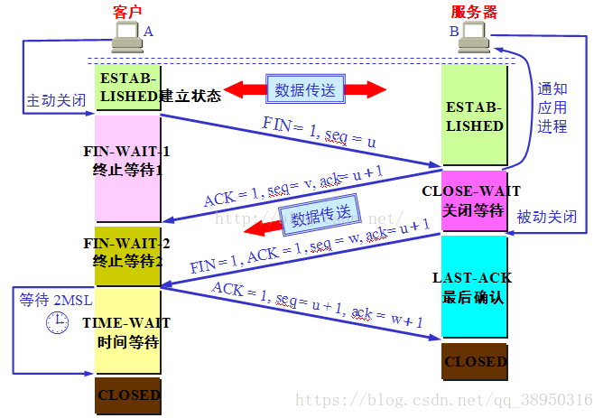
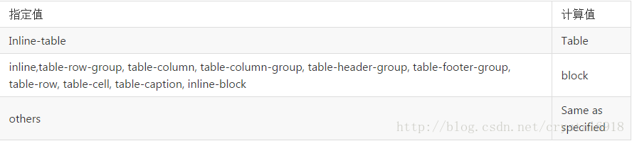

### 1、什么是防抖和节流？有什么区别？如何实现？

**防抖**

> 触发高频事件后n秒内函数只会执行一次，如果n秒内高频事件再次被触发，则重新计算时间

- 思路：

> 每次触发事件时都取消之前的延时调用方法

**节流**

> 高频事件触发，但在n秒内只会执行一次，所以节流会稀释函数的执行频率

- 思路：

> 每次触发事件时都判断当前是否有等待执行的延时函数

### 2、 get请求传参长度的误区、get和post请求在缓存方面的区别

实际上HTTP 协议从未规定 GET/POST 的请求长度限制是多少。对get请求参数的限制是来源与浏览器或web服务器，浏览器或web服务器限制了url的长度。为了明确这个概念，我们必须再次强调下面几点:

- HTTP 协议 未规定 GET 和POST的长度限制
- GET的最大长度显示是因为 浏览器和 web服务器限制了 URL的长度
- 不同的浏览器和WEB服务器，限制的最大长度不一样
- 要支持IE，则最大长度为2083byte，若只支持Chrome，则最大长度 8182byte

补充补充一个get和post在缓存方面的区别：

- get请求类似于查找的过程，用户获取数据，可以不用每次都与数据库连接，所以可以使用缓存。
- post不同，post做的一般是修改和删除的工作，所以必须与数据库交互，所以不能使用缓存。因此get请求适合于请求缓存。

### 3、模块化发展历程

#### 模块化的好处

- 避免命名冲突(减少命名空间污染)
- 更好的分离, 按需加载
- 更高复用性
- 高可维护性

可从IIFE、AMD、CMD、CommonJS、UMD、webpack(require.ensure)、ES Module、`<script type="module">` 这几个角度考虑。

模块化主要是用来抽离公共代码，隔离作用域，避免变量冲突等。

**IIFE**：使用自执行函数来编写模块化，特点：**在一个单独的函数作用域中执行代码，避免变量冲突**。

**AMD**：使用requireJS 来编写模块化，特点：**依赖必须提前声明好**。

**CMD**：使用seaJS 来编写模块化，特点：**支持动态引入依赖文件**。

**CommonJS**：nodejs 中自带的模块化。

**UMD**：兼容AMD，CommonJS 模块化语法。

**webpack(require.ensure)**：webpack 2.x 版本中的代码分割。

**ES Modules**：ES6 引入的模块化，支持import 来引入另一个 js 。

#### ES6 模块与 CommonJS 模块的差异

它们有两个重大差异：

**① CommonJS 模块输出的是一个值的拷贝，ES6 模块输出的是值的引用**。

**② CommonJS 模块是运行时加载，ES6 模块是编译时输出接口**。

第二个差异是因为 CommonJS 加载的是一个对象（即module.exports属性），该对象只有在脚本运行完才会生成。而 ES6 模块不是对象，它的对外接口只是一种静态定义，在代码静态解析阶段就会生成。

#### 总结

CommonJS规范主要用于服务端编程，加载模块是同步的，这并不适合在浏览器环境，因为同步意味着阻塞加载，浏览器资源是异步加载的，因此有了AMD CMD解决方案。
AMD规范在浏览器环境中异步加载模块，而且可以并行加载多个模块。不过，AMD规范开发成本高，代码的阅读和书写比较困难，模块定义方式的语义不顺畅。
CMD规范与AMD规范很相似，都用于浏览器编程，依赖就近，延迟执行，可以很容易在Node.js中运行。不过，依赖SPM 打包，模块的加载逻辑偏重
ES6 在语言标准的层面上，实现了模块功能，而且实现得相当简单，完全可以取代 CommonJS 和 AMD 规范，成为浏览器和服务器通用的模块解决方案。

### 4、npm 模块安装机制，为什么输入 npm install 就可以自动安装对应的模块？

#### 1. npm 模块安装机制：

- 发出`npm install`命令

- 查询node_modules目录之中是否已经存在指定模块

- - npm 向 registry 查询模块压缩包的网址
  - 下载压缩包，存放在根目录下的`.npm`目录里
  - 解压压缩包到当前项目的`node_modules`目录
  - 若存在，不再重新安装
  - 若不存在

#### 2. npm 实现原理

输入 npm install 命令并敲下回车后，会经历如下几个阶段（以 npm 5.5.1 为例）：

1. 执行工程自身 preinstall

   当前 npm 工程如果定义了 preinstall 钩子此时会被执行。

2. 确定首层依赖模块

   首先需要做的是确定工程中的首层依赖，也就是 dependencies 和 devDependencies 属性中直接指定的模块（假设此时没有添加 npm install 参数）。

   工程本身是整棵依赖树的根节点，每个首层依赖模块都是根节点下面的一棵子树，npm 会开启多进程从每个首层依赖模块开始逐步寻找更深层级的节点。

3. **获取模块**

   获取模块是一个递归的过程，分为以下几步：

4. - 获取模块信息。在下载一个模块之前，首先要确定其版本，这是因为 package.json 中往往是 semantic version（semver，语义化版本）。此时如果版本描述文件（npm-shrinkwrap.json 或 package-lock.json）中有该模块信息直接拿即可，如果没有则从仓库获取。如 packaeg.json 中某个包的版本是 ^1.1.0，npm 就会去仓库中获取符合 1.x.x 形式的最新版本。
   - 获取模块实体。上一步会获取到模块的压缩包地址（resolved 字段），npm 会用此地址检查本地缓存，缓存中有就直接拿，如果没有则从仓库下载。
   - 查找该模块依赖，如果有依赖则回到第1步，如果没有则停止。

5. 模块扁平化（dedupe）

   上一步获取到的是一棵完整的依赖树，其中可能包含大量重复模块。比如 A 模块依赖于 loadsh，B 模块同样依赖于 lodash。在 npm3 以前会严格按照依赖树的结构进行安装，因此会造成模块冗余。

   从 npm3 开始默认加入了一个 dedupe 的过程。它会遍历所有节点，逐个将模块放在根节点下面，也就是 node-modules 的第一层。当发现有**重复模块**时，则将其丢弃。

   这里需要对**重复模块**进行一个定义，它指的是**模块名相同**且 **semver 兼容。每个 semver 都对应一段版本允许范围，如果两个模块的版本允许范围存在交集，那么就可以得到一个兼容**版本，而不必版本号完全一致，这可以使更多冗余模块在 dedupe 过程中被去掉。

   比如 node-modules 下 foo 模块依赖 lodash@^1.0.0，bar 模块依赖 lodash@^1.1.0，则 **^1.1.0** 为兼容版本。

   而当 foo 依赖 lodash@^2.0.0，bar 依赖 lodash@^1.1.0，则依据 semver 的规则，二者不存在兼容版本。会将一个版本放在 node_modules 中，另一个仍保留在依赖树里。

   举个例子，假设一个依赖树原本是这样：

   node_modules -- foo ---- lodash@version1

   -- bar ---- lodash@version2

   假设 version1 和 version2 是兼容版本，则经过 dedupe 会成为下面的形式：

   node_modules -- foo

   -- bar

   -- lodash（保留的版本为兼容版本）

   假设 version1 和 version2 为非兼容版本，则后面的版本保留在依赖树中：

   node_modules -- foo -- lodash@version1

   -- bar ---- lodash@version2

6. 安装模块

   这一步将会更新工程中的 node_modules，并执行模块中的生命周期函数（按照 preinstall、install、postinstall 的顺序）。

7. 执行工程自身生命周期

   当前 npm 工程如果定义了钩子此时会被执行（按照 install、postinstall、prepublish、prepare 的顺序）。

   最后一步是生成或更新版本描述文件，npm install 过程完成。

### 5、ES5的继承和ES6的继承有什么区别？

ES5的继承时通过prototype或构造函数机制来实现。**ES5的继承实质上是先创建子类的实例对象，然后再将父类的方法添加到this上**（Parent.apply(this)）。

ES6的继承机制完全不同，**实质上是先创建父类的实例对象this（所以必须先调用父类的super()方法），然后再用子类的构造函数修改this**。

具体的：ES6通过class关键字定义类，里面有构造方法，类之间通过extends关键字实现继承。子类必须在constructor方法中调用super方法，否则新建实例报错。因为子类没有自己的this对象，而是继承了父类的this对象，然后对其进行加工。如果不调用super方法，子类得不到this对象。

ps：super关键字指代父类的实例，即父类的this对象。在子类构造函数中，调用super后，才可使用this关键字，否则报错。

#### 一、借用构造函数继承（call，apply，bind）

###### 1）优点

简单明了

###### 2）缺点

无法继承原型链上的属性和方法

#### 二、原型链继承

利用原型链来实现继承，父类的一个实例作为子类的原型，也就是 子构造函数.prototype = new 父构造函数()

###### 1）优点

容易实现

###### 2）缺点

当父类中包含引用类型属性值时，其中一个子类的多个实例中，只要其中一个实例引用属性只发生修改一个修改，其他实例的引用类型属性值也会立即发生改变
原因是父类的属性变成子类的原型属性

#### 三、组合式继承（原型链继承+借用构造函数继承）

实际开发比较常用（当然不考虑兼容性的话我更喜欢es6的extend）

###### 1）优点

解决了构造继承和原型链继承的两个问题

###### 2）缺点

父类的构造函数被调用两次，实际上子类上会拥有超类的两份属性，只是子类的属性覆盖了超类的属性

#### 四、es6的extends

实际开发比较常用，写法更加面向对象，原理还是原型链

```js
class Animal {
	constructor (name) {
		this.name = name
	}
	showName () {
		alert(this.name)
	}
}
class Cat extends Animal {
	constructor (name) {
		super(name)
		this.type = '宠物'
	}
}
```

##### 3.super关键字

super这个关键字，既可以当作函数使用，也可以当作对象使用。当作函数使用时，super代表父类的构造函数，并在子类中执行Parent.apply(this)，从而将父类实例对象的属性和方法，添加到子类的this上面。以下三点需要特别注意：

**1）子类必须在constructor方法中调用super方法，如果子类没有定义constructor方法，constructor方法以及其内部的super方法会被默认添加。**
**2）在子类的constructor方法中，只有调用super之后，才可以使用this关键字，否则会报错。**
**3）super作为对象时，在子类中指向父类的原型对象。即super=Parent.prototype。**

##### 4.static关键字

在一个方法前加上关键字static，就表示该方法不会被实例继承，但是父类的静态方法，会被子类继承。

### 6、setTimeout、Promise、Async/Await 的区别

前面有一篇文章专门将了js的运行机制，在任务分为宏任务与微任务，setTimeout属性宏任务，Promise里面的then方法属于微任务，Async/Await中await语法后面紧跟的表达式是同步的，但接下来的代码是异步的，属于微任务。

下面分别举例子来setTimeout、Promise、Async/Await的区别。

```js
 console.log("script start");
    setTimeout(function () {
        console.log('setTimeout')
    }, 0);
    console.log('script end');
```


输出顺序： script start -> script end -> setTimeout

Promise
Promise本身是同步的，但在执行resolve或者rejects时是异步的，即then方法是异步的。

```js
console.log("script start");
let promise1 = new Promise(function(resolve) {
    console.log("promise1");
    resolve();
    console.log("promise1 end");
}).then(function(){
    console.log('promise2');
})

setTimeout(function () {
    console.log('setTimeout');
}, 0)
console.log('script end');
```

输出顺序： script start -> promise1 -> promise1 end -> script end -> promise2 ->setTimeout

promise1.then()的回调放入 microtask queue（微任务队列）
setTimeout的回调放入macrotask queue （宏队列）即使是 0ms 的情况。

```js
    async function async1(){
        console.log('async1 start');
        await async2();
        console.log('async1 end')
    }
    async function async2(){
        console.log('async2')
    }
    console.log('script start');
async1();
console.log('script end')
```


输出顺序：script start -> async1 start -> async2 -> script end -> async1 end

async 函数返回一个 Promise 对象，当函数执行的时候，一旦遇到 await 就会先返回，等到触发的异步操作完成，再执行函数体内后面的语句。可以理解为，是让出了线程，跳出了 async 函数体。

await的含义为等待，也就是 async 函数需要等待await后的函数执行完成并且有了返回结果（Promise对象）之后，才能继续执行下面的代码。await通过返回一个Promise对象来实现同步的效果

### 7、定时器的执行顺序或机制？

**因为js是单线程的，浏览器遇到setTimeout或者setInterval会先执行完当前的代码块，在此之前会把定时器推入浏览器的待执行事件队列里面，等到浏览器执行完当前代码之后会看一下事件队列里面有没有任务，有的话才执行定时器的代码。**所以即使把定时器的时间设置为0还是会先执行当前的一些代码。

### 8、['1','2','3'].map(parseInt) 输出什么,为什么?

map() 方法返回一个新数组，数组中的元素为原始数组元素调用函数处理后的值。

map() 方法按照原始数组元素顺序依次处理元素。

**注意：** map() 不会对空数组进行检测。

**注意：** map() 不会改变原始数组。

输出：**[1, NaN, NaN]**

- 首先让我们回顾一下，map函数的第一个参数callback：

`var new_array = arr.map(function callback(currentValue[, index[, array]]) { // Return element for new_array }[, thisArg])`这个callback一共可以接收三个参数，其中第一个参数代表当前被处理的元素，而第二个参数代表该元素的索引。

- 而parseInt则是用来解析字符串的，使字符串成为指定基数的整数。`parseInt(string, radix)`接收两个参数，第一个表示被处理的值（字符串），第二个表示为解析时的基数。
- 了解这两个函数后，我们可以模拟一下运行情况

1. parseInt('1', 0) //radix为0时，且string参数不以“0x”和“0”开头时，按照10为基数处理。这个时候返回1
2. parseInt('2', 1) //基数为1（1进制）表示的数中，最大值小于2，所以无法解析，返回NaN
3. parseInt('3', 2) //基数为2（2进制）表示的数中，最大值小于3，所以无法解析，返回NaN

- map函数返回的是一个数组，所以最后结果为[1, NaN, NaN]

### 9、Doctype作用? 严格模式与混杂模式如何区分？它们有何意义?

Doctype声明于文档最前面，告诉浏览器以何种方式来渲染页面，这里有两种模式，严格模式和混杂模式。

- 严格模式的排版和 JS 运作模式是 以该浏览器支持的最高标准运行。
- 混杂模式，向后兼容，模拟老式浏览器，防止浏览器无法兼容页面。

### 10、fetch发送2次请求的原因

**fetch发送post请求的时候，总是发送2次，第一次状态码是204，第二次才成功？**

原因很简单，因为你用fetch的post请求的时候，导致fetch 第一次发送了一个Options请求，询问服务器是否支持修改的请求头，如果服务器支持，则在第二次中发送真正的请求。

## http、浏览器对象

### 1、HTTPS 握手过程中，客户端如何验证证书的合法性

- 首先什么是HTTP协议?

http协议是超文本传输协议，位于tcp/ip四层模型中的应用层；通过请求/响应的方式在客户端和服务器之间进行通信；但是缺少安全性，http协议信息传输是通过明文的方式传输，不做任何加密，相当于在网络上裸奔；容易被中间人恶意篡改，这种行为叫做中间人攻击；

- 加密通信：

  为了安全性，双方可以使用对称加密的方式key进行信息交流，但是这种方式对称加密秘钥也会被拦截，也不够安全，进而还是存在被中间人攻击风险；于是人们又想出来另外一种方式，使用非对称加密的方式；使用公钥/私钥加解密；通信方A发起通信并携带自己的公钥，接收方B通过公钥来加密对称秘钥；然后发送给发起方A；A通过私钥解密；双发接下来通过对称秘钥来进行加密通信；但是这种方式还是会存在一种安全性；中间人虽然不知道发起方A的私钥，但是可以做到偷天换日，将拦截发起方的公钥key;并将自己生成的一对公/私钥的公钥发送给B；接收方B并不知道公钥已经被偷偷换过；按照之前的流程，B通过公钥加密自己生成的对称加密秘钥key2;发送给A；这次通信再次被中间人拦截，尽管后面的通信，两者还是用key2通信，但是中间人已经掌握了Key2;可以进行轻松的加解密；还是存在被中间人攻击风险；

- 解决困境：权威的证书颁发机构CA来解决；

- - 制作证书：作为服务端的A，首先把自己的公钥key1发给证书颁发机构，向证书颁发机构进行申请证书；证书颁发机构有一套自己的公私钥，CA通过自己的私钥来加密key1,并且通过服务端网址等信息生成一个证书签名，证书签名同样使用机构的私钥进行加密；制作完成后，机构将证书发给A；
  - 校验证书真伪：当B向服务端A发起请求通信的时候，A不再直接返回自己的公钥，而是返回一个证书；

说明：各大浏览器和操作系统已经维护了所有的权威证书机构的名称和公钥。B只需要知道是哪个权威机构发的证书，使用对应的机构公钥，就可以解密出证书签名；接下来，B使用同样的规则，生成自己的证书签名，如果两个签名是一致的，说明证书是有效的；签名验证成功后，B就可以再次利用机构的公钥，解密出A的公钥key1;接下来的操作，就是和之前一样的流程了；

- 中间人是否会拦截发送假证书到B呢？

因为证书的签名是由服务器端网址等信息生成的，并且通过第三方机构的私钥加密中间人无法篡改；所以最关键的问题是证书签名的真伪；

- https主要的思想是在http基础上增加了ssl安全层，即以上认证过程；

### 2、TCP三次握手和四次挥手




三次握手之所以是三次是保证client和server均让对方知道自己的接收和发送能力没问题而保证的最小次数。

第一次client => server 只能server判断出client具备发送能力 第二次 server => client client就可以判断出server具备发送和接受能力。此时client还需让server知道自己接收能力没问题于是就有了第三次 第三次 client => server 双方均保证了自己的接收和发送能力没有问题

其中，为了保证后续的握手是为了应答上一个握手，每次握手都会带一个标识 seq，后续的ACK都会对这个seq进行加一来进行确认。

#### 为什么连接的时候是三次握手，关闭的时候却是四次握手？

答：因为当Server端收到Client端的SYN连接请求报文后，可以直接发送SYN+ACK报文。其中ACK报文是用来应答的，SYN报文是用来同步的。但是关闭连接时，当Server端收到FIN报文时，很可能并不会立即关闭SOCKET，所以只能先回复一个ACK报文，告诉Client端，"你发的FIN报文我收到了"。只有等到我Server端所有的报文都发送完了，我才能发送FIN报文，因此不能一起发送。故需要四步握手。


#### 为什么TIME_WAIT状态需要经过2MSL(最大报文段生存时间)才能返回到CLOSE状态？

答：虽然按道理，四个报文都发送完毕，我们可以直接进入CLOSE状态了，但是我们必须假象网络是不可靠的，有可以最后一个ACK丢失。所以TIME_WAIT状态就是用来重发可能丢失的ACK报文。在Client发送出最后的ACK回复，但该ACK可能丢失。Server如果没有收到ACK，将不断重复发送FIN片段。所以Client不能立即关闭，它必须确认Server接收到了该ACK。Client会在发送出ACK之后进入到TIME_WAIT状态。Client会设置一个计时器，等待2MSL的时间。如果在该时间内再次收到FIN，那么Client会重发ACK并再次等待2MSL。所谓的2MSL是两倍的MSL(Maximum Segment Lifetime)。MSL指一个片段在网络中最大的存活时间，2MSL就是一个发送和一个回复所需的最大时间。如果直到2MSL，Client都没有再次收到FIN，那么Client推断ACK已经被成功接收，则结束TCP连接。


#### 为什么不能用两次握手进行连接？

答：3次握手完成两个重要的功能，既要双方做好发送数据的准备工作(双方都知道彼此已准备好)，也要允许双方就初始序列号进行协商，这个序列号在握手过程中被发送和确认。

   现在把三次握手改成仅需要两次握手，死锁是可能发生的。作为例子，考虑计算机S和C之间的通信，假定C给S发送一个连接请求分组，S收到了这个分组，并发 送了确认应答分组。按照两次握手的协定，S认为连接已经成功地建立了，可以开始发送数据分组。可是，C在S的应答分组在传输中被丢失的情况下，将不知道S 是否已准备好，不知道S建立什么样的序列号，C甚至怀疑S是否收到自己的连接请求分组。在这种情况下，C认为连接还未建立成功，将忽略S发来的任何数据分 组，只等待连接确认应答分组。而S在发出的分组超时后，重复发送同样的分组。这样就形成了死锁。

#### 如果已经建立了连接，但是客户端突然出现故障了怎么办？

TCP还设有一个保活计时器，显然，客户端如果出现故障，服务器不能一直等下去，白白浪费资源。服务器每收到一次客户端的请求后都会重新复位这个计时器，时间通常是设置为2小时，若两小时还没有收到客户端的任何数据，服务器就会发送一个探测报文段，以后每隔75秒钟发送一次。若一连发送10个探测报文仍然没反应，服务器就认为客户端出了故障，接着就关闭连接。

### 3、img iframe script 来发送跨域请求有什么优缺点？

- iframe

优点：跨域完毕之后DOM操作和互相之间的JavaScript调用都是没有问题的

缺点：1.若结果要以URL参数传递，这就意味着在结果数据量很大的时候需要分割传递，巨烦。2.还有一个是iframe本身带来的，母页面和iframe本身的交互本身就有安全性限制。

- script

优点：可以直接返回json格式的数据，方便处理

缺点：只接受GET请求方式

- 图片ping

优点：可以访问任何url，一般用来进行点击追踪，做页面分析常用的方法

缺点：不能访问响应文本，只能监听是否响应

### 4、http和https的区别？

http传输的数据都是未加密的，也就是明文的，网景公司设置了SSL协议来对http协议传输的数据进行加密处理，简单来说https协议是由http和ssl协议构建的可进行加密传输和身份认证的网络协议，比http协议的安全性更高。主要的区别如下：

- Https协议需要ca证书，费用较高。
- http是超文本传输协议，信息是明文传输，https则是具有安全性的ssl加密传输协议。
- 使用不同的链接方式，端口也不同，一般而言，http协议的端口为80，https的端口为443
- http的连接很简单，是无状态的；HTTPS协议是由SSL+HTTP协议构建的可进行加密传输、身份认证的网络协议，比http协议安全。

### 5、什么是Bom？有哪些常用的Bom属性？

Bom是浏览器对象

**location对象**

- location.href-- 返回或设置当前文档的URL
- location.search -- 返回URL中的查询字符串部分。例如 http://www.dreamdu.com/dreamd... 返回包括(?)后面的内容?id=5&name=dreamdu
- location.hash -- 返回URL#后面的内容，如果没有#，返回空 location.host -- 返回URL中的域名部分，例如www.dreamdu.com
- location.hostname -- 返回URL中的主域名部分，例如dreamdu.com
- location.pathname -- 返回URL的域名后的部分。例如 http://www.dreamdu.com/xhtml/ 返回/xhtml/
- location.port -- 返回URL中的端口部分。例如 http://www.dreamdu.com:8080/xhtml/ 返回8080
- location.protocol -- 返回URL中的协议部分。例如 http://www.dreamdu.com:8080/xhtml/ 返回(//)前面的内容http:
- location.assign -- 设置当前文档的URL
- location.replace() -- 设置当前文档的URL，并且在history对象的地址列表中移除这个URL location.replace(url);
- location.reload() -- 重载当前页面

**history对象**

- history.go() -- 前进或后退指定的页面数
- history.go(num); history.back() -- 后退一页
- history.forward() -- 前进一页

**Navigator对象**

- navigator.userAgent -- 返回用户代理头的字符串表示(就是包括浏览器版本信息等的字符串)
- navigator.cookieEnabled -- 返回浏览器是否支持(启用)cookie

### 6、Cookie、sessionStorage、localStorage的区别

共同点：都是保存在浏览器端，并且是同源的

- Cookie：cookie数据始终在同源的http请求中携带（即使不需要），即cookie在浏览器和服务器间来回传递。而sessionStorage和localStorage不会自动把数据发给服务器，仅在本地保存。cookie数据还有路径（path）的概念，可以限制cookie只属于某个路径下,存储的大小很小只有4K左右。（key：可以在浏览器和服务器端来回传递，存储容量小，只有大约4K左右）
- sessionStorage：仅在当前浏览器窗口关闭前有效，自然也就不可能持久保持，localStorage：始终有效，窗口或浏览器关闭也一直保存，因此用作持久数据；cookie只在设置的cookie过期时间之前一直有效，即使窗口或浏览器关闭。（key：本身就是一个回话过程，关闭浏览器后消失，session为一个回话，当页面不同即使是同一页面打开两次，也被视为同一次回话）
- localStorage：localStorage 在所有同源窗口中都是共享的；cookie也是在所有同源窗口中都是共享的。（key：同源窗口都会共享，并且不会失效，不管窗口或者浏览器关闭与否都会始终生效）

补充说明一下cookie的作用：

- 保存用户登录状态。例如将用户id存储于一个cookie内，这样当用户下次访问该页面时就不需要重新登录了，现在很多论坛和社区都提供这样的功能。cookie还可以设置过期时间，当超过时间期限后，cookie就会自动消失。因此，系统往往可以提示用户保持登录状态的时间：常见选项有一个月、三个 月、一年等。
- 跟踪用户行为。例如一个天气预报网站，能够根据用户选择的地区显示当地的天气情况。如果每次都需要选择所在地是烦琐的，当利用了 cookie后就会显得很人性化了，系统能够记住上一次访问的地区，当下次再打开该页面时，它就会自动显示上次用户所在地区的天气情况。因为一切都是在后 台完成，所以这样的页面就像为某个用户所定制的一样，使用起来非常方便
- 定制页面。如果网站提供了换肤或更换布局的功能，那么可以使用cookie来记录用户的选项，例如：背景色、分辨率等。当用户下次访问时，仍然可以保存上一次访问的界面风格。

### 7、Cookie如何防范XSS攻击

XSS（跨站脚本攻击）是指攻击者在返回的HTML中嵌入javascript脚本，为了减轻这些攻击，需要在HTTP头部配上，set-cookie：

- httponly-这个属性可以防止XSS,它会禁止javascript脚本来访问cookie。
- secure - 这个属性告诉浏览器仅在请求为https的时候发送cookie。

结果应该是这样的：Set-Cookie=.....

### 8、浏览器和 Node 事件循环的区别？

其中一个主要的区别在于浏览器的event loop 和nodejs的event loop 在处理异步事件的顺序是不同的,

nodejs中有micro event;

其中Promise属于micro event 该异步事件的处理顺序就和浏览器不同.

nodejs V11.0以上 这两者之间的顺序就相同了.

```js
function test () {
   console.log('start')
    setTimeout(() => {
        console.log('children2')
        Promise.resolve().then(() => {console.log('children2-1')})
    }, 0)
    setTimeout(() => {
        console.log('children3')
        Promise.resolve().then(() => {console.log('children3-1')})
    }, 0)
    Promise.resolve().then(() => {console.log('children1')})
    console.log('end') 
}

test()

// 以上代码在node11以下版本的执行结果(先执行所有的宏任务，再执行微任务)
// start
// end
// children1
// children2
// children3
// children2-1
// children3-1

// 以上代码在node11及浏览器的执行结果(顺序执行宏任务和微任务)
// start
// end
// children1
// children2
// children2-1
// children3
// children3-1
```

### 9、简述HTTPS中间人攻击

https协议由 http + ssl 协议构成，具体的链接过程可参考SSL或TLS握手的概述

中间人攻击过程如下：

1. 服务器向客户端发送公钥。
2. 攻击者截获公钥，保留在自己手上。
3. 然后攻击者自己生成一个【伪造的】公钥，发给客户端。
4. 客户端收到伪造的公钥后，生成加密hash值发给服务器。
5. 攻击者获得加密hash值，用自己的私钥解密获得真秘钥。
6. 同时生成假的加密hash值，发给服务器。
7. 服务器用私钥解密获得假秘钥。
8. 服务器用加秘钥加密传输信息

防范方法：

1. 服务端在发送浏览器的公钥中加入CA证书，浏览器可以验证CA证书的有效性

### 10、说几条web前端优化策略

减少css文件

精灵图

压缩

懒加载

(1). 减少HTTP请求数

这条策略基本上所有前端人都知道，而且也是最重要最有效的。都说要减少HTTP请求，那请求多了到底会怎么样呢？首先，每个请求都是有成本的，既包 含时间成本也包含资源成本。一个完整的请求都需要经过DNS寻址、与服务器建立连接、发送数据、等待服务器响应、接收数据这样一个“漫长”而复杂的过程。时间成本就是用户需要看到或者“感受”到这个资源是必须要等待这个过程结束的，资源上由于每个请求都需要携带数据，因此每个请求都需要占用带宽。

另外，由于浏览器进行并发请求的请求数是有上限的，因此请求数多了以后，浏览器需要分批进行请求，因此会增加用户的等待时间，会给 用户造成站点速度慢这样一个印象，即使可能用户能看到的第一屏的资源都已经请求完了，但是浏览器的进度条会一直存在。减少HTTP请求数的主要途径包括：

(2). 从设计实现层面简化页面

如果你的页面像百度首页一样简单，那么接下来的规则基本上都用不着了。保持页面简洁、减少资源的使用时最直接的。如果不是这样，你的页面需要华丽的皮肤，则继续阅读下面的内容。

(3). 合理设置HTTP缓存

缓存的力量是强大的，恰当的缓存设置可以大大的减少HTTP请求。以有啊首页为例，当浏览器没有缓存的时候访问一共会发出78个请求，共600多K 数据（如图1.1），而当第二次访问即浏览器已缓存之后访问则仅有10个请求，共20多K数据（如图1.2）。（这里需要说明的是，如果直接F5刷新页面 的话效果是不一样的，这种情况下请求数还是一样，不过被缓存资源的请求服务器是304响应，只有Header没有Body，可以节省带宽）

怎样才算合理设置？原则很简单，能缓存越多越好，能缓存越久越好。例如，很少变化的图片资源可以直接通过HTTP Header中的Expires设置一个很长的过期头；变化不频繁而又可能会变的资源可以使用Last-Modifed来做请求验证。尽可能的让资源能够 在缓存中待得更久。

(4). 资源合并与压缩

如果可以的话，尽可能的将外部的脚本、样式进行合并，多个合为一个。另外，CSS、Javascript、Image都可以用相应的工具进行压缩，压缩后往往能省下不少空间。

(5). CSS Sprites

合并CSS图片，减少请求数的又一个好办法。

(6). Inline Images

使用data: URL scheme的方式将图片嵌入到页面或CSS中，如果不考虑资源管理上的问题的话，不失为一个好办法。如果是嵌入页面的话换来的是增大了页面的体积，而且无法利用浏览器缓存。使用在CSS中的图片则更为理想一些。

(7). Lazy Load Images

这条策略实际上并不一定能减少HTTP请求数，但是却能在某些条件下或者页面刚加载时减少HTTP请求数。对于图片而言，在页面刚加载的时候可以只 加载第一屏，当用户继续往后滚屏的时候才加载后续的图片。这样一来，假如用户只对第一屏的内容感兴趣时，那剩余的图片请求就都节省了。有啊首页曾经的做法 是在加载的时候把第一屏之后的图片地址缓存在Textarea标签中，待用户往下滚屏的时候才“惰性”加载。

### 11、你了解的浏览器的重绘和回流导致的性能问题

**重绘（Repaint）和回流（Reflow）**

重绘和回流是渲染步骤中的一小节，但是这两个步骤对于性能影响很大。

- 重绘是当节点需要更改外观而不会影响布局的，比如改变 `color`就叫称为重绘
- 回流是布局或者几何属性需要改变就称为回流。

回流必定会发生重绘，重绘不一定会引发回流。回流所需的成本比重绘高的多，改变深层次的节点很可能导致父节点的一系列回流。

所以以下几个动作可能会导致性能问题：

- 改变 window 大小
- 改变字体
- 添加或删除样式
- 文字改变
- 定位或者浮动
- 盒模型

很多人不知道的是，重绘和回流其实和 Event loop 有关。

1. 当 Event loop 执行完 Microtasks 后，会判断 document 是否需要更新。因为浏览器是 60Hz 的刷新率，每 16ms 才会更新一次。
2. 然后判断是否有 `resize`或者 `scroll`，有的话会去触发事件，所以 `resize`和 `scroll`事件也是至少 16ms 才会触发一次，并且自带节流功能。
3. 判断是否触发了 media query
4. 更新动画并且发送事件
5. 判断是否有全屏操作事件
6. 执行 `requestAnimationFrame`回调
7. 执行 `IntersectionObserver`回调，该方法用于判断元素是否可见，可以用于懒加载上，但是兼容性不好
8. 更新界面
9. 以上就是一帧中可能会做的事情。如果在一帧中有空闲时间，就会去执行 `requestIdleCallback`回调。

使用 `translate` 替代 `top`

```html
<div class="test"></div>
<style>
    .test {
        position: absolute;
        top: 10px;
        width: 100px;
        height: 100px;
        background: red;
    }
</style>
<script>
    setTimeout(() => {
        // 引起回流
        document.querySelector('.test').style.top = '100px'
    }, 1000)
</script>
```

- 使用 `visibility`替换 `display: none`，因为前者只会引起重绘，后者会引发回流（改变了布局）

  把 DOM 离线后修改，比如：先把 DOM 给 `display:none`(有一次 Reflow)，然后你修改100次，然后再把它显示出来

  不要把 DOM 结点的属性值放在一个循环里当成循环里的变量

  ```js
  for(let i = 0; i < 1000; i++) {
      // 获取 offsetTop 会导致回流，因为需要去获取正确的值
      console.log(document.querySelector('.test').style.offsetTop)
  }
  ```

- 不要使用 table 布局，可能很小的一个小改动会造成整个 table 的重新布局

- 动画实现的速度的选择，动画速度越快，回流次数越多，也可以选择使用 `requestAnimationFrame`

- CSS 选择符从右往左匹配查找，避免 DOM 深度过深

- 将频繁运行的动画变为图层，图层能够阻止该节点回流影响别的元素。比如对于 `video`标签，浏览器会自动将该节点变为图层。

## react、Vue

### 1、写 React / Vue 项目时为什么要在列表组件中写 key，其作用是什么？

#### diff算法

就是进行虚拟节点对比，并返回一个patch对象，用来存储两个节点不同的地方，最后用patch记录的消息去局部更新Dom。

**其有两个特点：**

- 比较只会在同层级进行, 不会跨层级比较
- 在diff比较的过程中，循环从两边向中间比较


#### Diff算法的步骤：

用 JavaScript 对象结构表示 DOM 树的结构；然后用这个树构建一个真正的 DOM 树，插到文 档当中
当状态变更的时候，重新构造一棵新的对象树。然后用新的树和旧的树进行比较(diff)，记录两棵树差异
把第二棵树所记录的差异应用到第一棵树所构建的真正的DOM树上(patch)，视图就更新了

vue和react都是采用diff算法来对比新旧虚拟节点，从而更新节点。在vue的diff函数中（建议先了解一下diff算法过程）。在交叉对比中，当新节点跟旧节点`头尾交叉对比`没有结果时，会根据新节点的key去对比旧节点数组中的key，从而找到相应旧节点（这里对应的是一个key => index 的map映射）。如果没找到就认为是一个新增节点。而如果没有key，那么就会采用遍历查找的方式去找到对应的旧节点。一种一个map映射，另一种是遍历查找。相比而言。map映射的速度更快。vue部分源码如下：

### 2、为什么虚拟dom会提高性能?

虚拟dom相当于在js和真实dom中间加了一个缓存，利用dom diff算法避免了没有必要的dom操作，从而提高性能。

具体实现步骤如下：

用 JavaScript 对象结构表示 DOM 树的结构；然后用这个树构建一个真正的 DOM 树，插到文档当中

当状态变更的时候，重新构造一棵新的对象树。然后用新的树和旧的树进行比较，记录两棵树差异

把2所记录的差异应用到步骤1所构建的真正的DOM树上，视图就更新了。

## css

### 1、分析比较 opacity: 0、visibility: hidden、display: none 优劣和适用场景

结构：display:none: 会让元素完全从渲染树中消失，渲染的时候不占据任何空间, 不能点击， visibility: hidden:不会让元素从渲染树消失，渲染元素继续占据空间，只是内容不可见，不能点击 opacity: 0: 不会让元素从渲染树消失，渲染元素继续占据空间，只是内容不可见，可以点击

继承：display: none：是非继承属性，子孙节点消失由于元素从渲染树消失造成，通过修改子孙节点属性无法显示。visibility: hidden：是继承属性，子孙节点消失由于继承了hidden，通过设置visibility: visible;可以让子孙节点显式。

性能：displaynone : 修改元素会造成文档回流,读屏器不会读取display: none元素内容，性能消耗较大 visibility:hidden: 修改元素只会造成本元素的重绘,性能消耗较少读屏器读取visibility: hidden元素内容 opacity: 0 ：修改元素会造成重绘，性能消耗较少

联系：它们都能让元素不可见

### 2、清除浮动的方式有哪些?比较好的是哪一种?

常用的一般为三种`.clearfix`, `clear:both`,`overflow:hidden`;

比较好是 `.clearfix`,伪元素万金油版本,后两者有局限性.

```css
.clearfix:after {
  visibility: hidden;
  display: block;
  font-size: 0;
  content: " ";
  clear: both;
  height: 0;
}

<!--
为毛没有 zoom ,_height 这些,IE6,7这类需要 csshack 不再我们考虑之内了
.clearfix 还有另外一种写法,
-->

.clearfix:before, .clearfix:after {
    content:"";
    display:table;
}
.clearfix:after{
    clear:both;
    overflow:hidden;
}
.clearfix{
    zoom:1;
}

<!--
用display:table 是为了避免外边距margin重叠导致的margin塌陷,
内部元素默认会成为 table-cell 单元格的形式
-->
```

`clear:both`:若是用在同一个容器内相邻元素上,那是贼好的,有时候在容器外就有些问题了, 比如相邻容器的包裹层元素塌陷

`overflow:hidden`:这种若是用在同个容器内,可以形成 `BFC`避免浮动造成的元素塌陷

### 3、css sprite 是什么,有什么优缺点

概念：将多个小图片拼接到一个图片中。通过 background-position 和元素尺寸调节需要显示的背景图案。

优点：

1. 减少 HTTP 请求数，极大地提高页面加载速度
2. 增加图片信息重复度，提高压缩比，减少图片大小
3. 更换风格方便，只需在一张或几张图片上修改颜色或样式即可实现

缺点：

1. 图片合并麻烦
2. 维护麻烦，修改一个图片可能需要重新布局整个图片，样式

### 4、`link`与`@import`的区别

1. `link`是 HTML 方式， `@import`是 CSS 方式
2. `link`最大限度支持并行下载，`@import`过多嵌套导致串行下载，出现FOUC
3. `link`可以通过`rel="alternate stylesheet"`指定候选样式
4. 浏览器对`link`支持早于`@import`，可以使用`@import`对老浏览器隐藏样式
5. `@import`必须在样式规则之前，可以在 css 文件中引用其他文件
6. 总体来说：**link 优于@import**

### 5、`display: block;`和`display: inline;`的区别

#### `block`元素特点：

1.处于常规流中时，如果`width`没有设置，会自动填充满父容器

 2.可以应用`margin/padding` 3.在没有设置高度的情况下会扩展高度以包含常规流中的子元素 

4.处于常规流中时布局时在前后元素位置之间（独占一个水平空间） 

5.忽略`vertical-align`

#### `inline`元素特点

1.水平方向上根据`direction`依次布局

2.不会在元素前后进行换行

3.受`white-space`控制

4.`margin/padding`在竖直方向上无效，水平方向上有效

5.`width/height`属性对非替换行内元素无效，宽度由元素内容决定

6.非替换行内元素的行框高由`line-height`确定，替换行内元素的行框高由`height`,`margin`,`padding`,`border`决定 7.浮动或绝对定位时会转换为`block`8.`vertical-align`属性生效

### 6、PNG,GIF,JPG 的区别及如何选

**GIF**:

1. 8 位像素，256 色
2. 无损压缩
3. 支持简单动画
4. 支持 boolean 透明
5. 适合简单动画

**JPEG**：

1. 颜色限于 256
2. 有损压缩
3. 可控制压缩质量
4. 不支持透明
5. 适合照片

**PNG**：

1. 有 PNG8 和 truecolor PNG
2. PNG8 类似 GIF 颜色上限为 256，文件小，支持 alpha 透明度，无动画
3. 适合图标、背景、按钮

### 7、display,float,position 的关系

1. 如果`display`为 none，那么 position 和 float 都不起作用，这种情况下元素不产生框
2. 否则，如果 position 值为 absolute 或者 fixed，框就是绝对定位的，float 的计算值为 none，display 根据下面的表格进行调整。
3. 否则，如果 float 不是 none，框是浮动的，display 根据下表进行调整
4. 否则，如果元素是根元素，display 根据下表进行调整
5. 其他情况下 display 的值为指定值 总结起来：**绝对定位、浮动、根元素都需要调整display**




## JavaScript

### 1、JS有几种数据类型,其中基本数据类型有哪些?

**七种数据类型**

- Boolean
- Null
- Undefined
- Number
- String
- Symbol (ECMAScript 6 新定义)
- Object

### 2、JS的四种设计模式

设计模式是解决某个特定场景下对某种问题的解决方案

**工厂模式**

简单的工厂模式可以理解为解决多个相似的问题;

**单例模式**

只能被实例化(构造函数给实例添加属性与方法)一次

