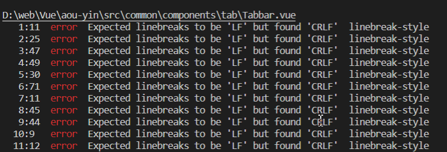
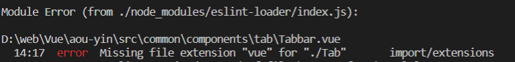

## 踩坑汇总

### 1.引入移动端调试申请 Eruda放错位置

我放到了App.vue中


#### 修改

放到了public/index.html中

### 2.浏览器问题


#### 修改：在postcss.config.js中

```
        'autoprefixer':{
            overrideBrowserslist: [
              "Android 4.1",
              "iOS 7.1",
              "Chrome > 31",
              "ff > 31",
              "ie >= 8"
              //'last 10 versions', // 所有主流浏览器最近10版本用
          ],
          grid: true
        },
```

### 3.postcss-pxtorem版本问题


#### 修改：调低版本

先卸载，后安装

 yarn remove  postcss-pxtorem

 yarn add  postcss-pxtorem@5.1.1


### 4.先要安装yarn add  lib-flexible normalize.css

import 'lib-flexible/flexible';

import 'normalize.css';


### 5.路径错误


在引入时，@后面没有加/


### 6.严格模式elint


基本都是Eslint严格模式引发的： 报错：“*Trailing* *spaces* *not* *allowed*” 解决：空格多了，删除多余的空格就可以了...


### 7.格式问题



把CRLF改成LF就好了

### 8.import时要使用全名



解决：import Tab from './Tab.vue';

### 9.格式问题


解决:在</style>后面加上一个回车即可